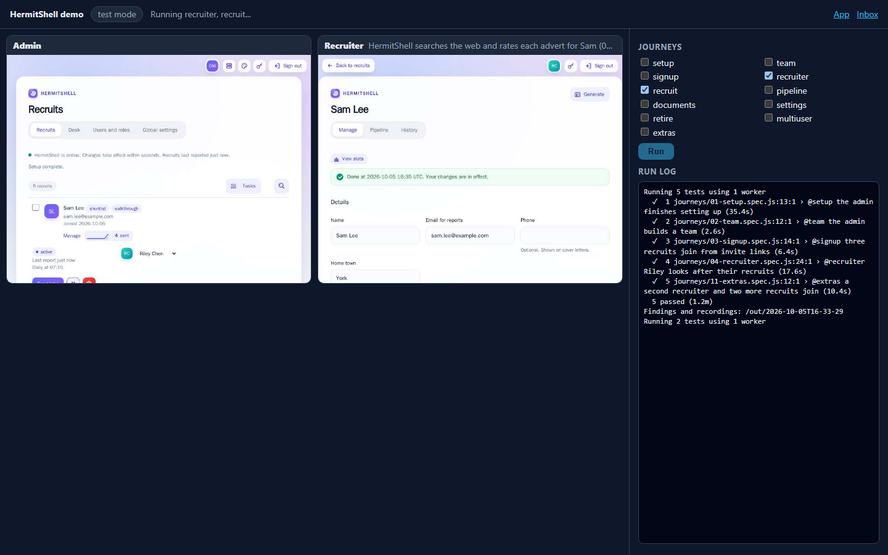
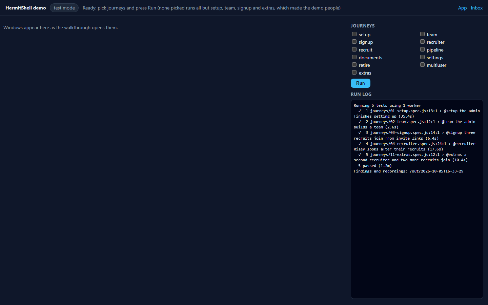

# The demo image

`hermitshell-demo` is HermitShell in one container with made-up people, made-up adverts and recorded AI
answers: no keys, no GPU, no Cloudflare account and no internet. Use it to show HermitShell, to try a change,
or to watch every feature run with technical detail. It is built and published by
[GitHub Actions](../.github/workflows/demo-image.yml) next to the production image. For a feature-by-feature
tour to follow along with, see [the demo guide](demo.md).

- [Run it](#run-it)
- [Modes](#modes)
- [The viewer](#the-viewer)
- [What's inside](#whats-inside)
- [Live mode](#live-mode)
- [Settings](#settings)
- [How it is built and checked](#how-it-is-built-and-checked)
- [Security](#security)

## Run it

```sh
docker run --rm --name hermitshell-demo --shm-size 1g \
  -p 127.0.0.1:8787:8787 -p 127.0.0.1:8025:8025 -p 127.0.0.1:8080:8080 \
  ghcr.io/metaheurist/hermitshell-demo demo
```

Then open the viewer at <http://localhost:8080>. The dashboard is at <https://localhost:8787/admin> (user
`admin`; the container's certificate is its own, so the browser asks once), and every email it sends is in
the inbox at <http://localhost:8025>. The admin password is made at random when the container first starts:

```sh
docker exec hermitshell-demo cat /data/explore/.env.explore    # EXPLORE_ADMIN_PASSWORD
```

or choose one with `-e DEMO_ADMIN_PASSWORD=...`. With Compose, from a checkout:

```sh
HERMITSHELL_DEMO_MODE=demo docker compose -f demo/docker-compose.demo.yml up
```

No registry access? Each version's [release](https://github.com/Metaheurist/HermitShell/releases) has the
image as a file for amd64 and arm64 (`gunzip -c hermitshell-demo-<version>-amd64.tar.gz | docker load`), or
build it: `docker build -f demo/Dockerfile -t hermitshell-demo .`

## Modes

The mode is the container's argument (or `HERMITSHELL_DEMO_MODE`):

| Mode | What it does |
| --- | --- |
| `app` (default) | Adds the demo people and their jobs on first start, then leaves HermitShell running to use by hand |
| `demo` | A clean showcase: the viewer plays the walkthrough feature by feature, slowly, with captions, then leaves the app to explore |
| `test` | The viewer with a test panel: adds the demo people, then you pick journeys, press **Run** and read the report |
| `autorun` | Runs every journey, writes the report, findings and video to `/out`, and exits 0 when all passed (1 if not) |

`autorun` suits a quick check of a change: mount a folder for the results.

```sh
docker build -f demo/Dockerfile -t hermitshell-demo .
docker run --rm --shm-size 1g -v "$PWD/demo-out:/out" hermitshell-demo autorun
```

`/out/summary.json` says whether it passed and where the report is; `DEMO_KEEP=1` keeps the container running
afterwards. The folder must be writable by uid 10000.

## The viewer

<http://localhost:8080> shows every browser window the walkthrough opens, live (the Chrome DevTools
screencast), each with the caption of what that person is doing. In `test` and `autorun` modes a side panel
adds the journeys, the run log and links to the HTML report and `findings.md`. The journeys are the same as
the [exploratory walkthrough's](exploratory-testing.md#the-journeys).



In `test` mode, pick journeys and press **Run**; with none picked it runs every journey except setup, team,
signup and extras. Those made the demo people when the container started, so they only run again in a fresh
container (without a `/data` volume). The others can be run as often as you like.



The walkthrough can also be watched in real windows on your own screen: run the exploratory runner on the host
with `--target https://localhost:8787` ([how](exploratory-testing.md#walking-through-the-demo-image)).

## What's inside

| Part | Detail |
| --- | --- |
| HermitShell | The backend and its scheduler, the same code as the production image, with `HERMES_TIMEZONE=UTC` and the model picker off |
| Feedback Worker | The same Worker under `wrangler dev`, over https, with its data in `/data` |
| Inbox | Mailpit, over STARTTLS; every email lands here and nothing leaves the container |
| Search | Twelve fictional adverts at `*.example` companies, in Firecrawl's and Tavily's shapes |
| AI | Answers recorded from a real model for these people and adverts ([replay](exploratory-testing.md#replay-and-record)) |
| People | Admin Alex Morgan; manager Morgan Ellis; recruiters Riley Chen and Casey Quinn; recruits Sam Lee, Jordan Patel, Taylor Reid, Drew Harper and Avery Lane |
| Browser | Chromium (headless) driven by the walkthrough, streamed to the viewer |

Everyone and everything in it is made up. The Worker's own [demo mode](feedback-worker.md#demo-mode) (a busy
made-up desk shown on the dashboard) is separate and can be switched on from Global settings as usual.

## Live mode

With `HERMITSHELL_DEMO_LIVE=1`, a Firecrawl key and an Ollama server given at run time, the container
searches the web and asks a real model instead of replaying:

```sh
docker run --rm --shm-size 1g -p 127.0.0.1:8787:8787 -p 127.0.0.1:8025:8025 -p 127.0.0.1:8080:8080 \
  -e HERMITSHELL_DEMO_LIVE=1 -e FIRECRAWL_API_KEY -e OLLAMA_HOST=http://host.docker.internal:11434 \
  ghcr.io/metaheurist/hermitshell-demo test
```

The key is passed from your shell's environment (`-e FIRECRAWL_API_KEY` with no value), so it isn't typed on
the command line; it is never written to `/data` or shown.

## Settings

| Variable | Default | Meaning |
| --- | --- | --- |
| `HERMITSHELL_DEMO_MODE` | `app` | The mode, when no argument is given |
| `DEMO_ADMIN_PASSWORD` | random | The `/admin` password |
| `DEMO_SLOW` | `500` | Pause before each action in `demo` mode, in milliseconds |
| `DEMO_KEEP` | | `1` keeps an `autorun` container running after the run |
| `HERMITSHELL_DEMO_LIVE` | | `1` for [live mode](#live-mode), with `FIRECRAWL_API_KEY` and `OLLAMA_HOST` |
| `OLLAMA_MODEL` | `qwen3:4b-instruct-2507-q4_K_M` | The model live mode asks |

Data (the people, their jobs, the secrets and the CA) is kept in `/data`; mount a volume there to keep it
between runs, or leave it out for a fresh start each time.

## How it is built and checked

[`demo/Dockerfile`](../demo/Dockerfile) builds on `python:3.13-slim-bookworm` with Node, the Worker's
packages, Mailpit and Chromium, all pinned. The [Demo image workflow](../.github/workflows/demo-image.yml)
runs when the demo, the walkthrough or HermitShell's code changes:

1. the replay and viewer tests;
2. a native build on amd64 and on arm64 runners;
3. a smoke test of each with **no network at all**: the container must start, seed every demo person and
   their jobs, and answer over https;
4. a Trivy scan for vulnerabilities and secrets (fixable critical CVEs and any secret fail);
5. on `main` and version tags, both platforms pushed by digest and merged into one tag list at
   `ghcr.io/<owner>/hermitshell-demo` (`latest`, the version and the commit);
6. for a version tag, the image files attached to that release.

Changes to `demo/` and `explore/` don't rebuild the production image.

## Security

- No secret is baked in: the link secret, API token, admin password and CA are made at random on first start
  and kept in `/data` (mode 600), so two containers never share them.
- It runs as uid 10000 with every capability dropped and `no-new-privileges`; the examples publish ports on
  `127.0.0.1` only.
- The viewer is read-only except **Run** in `test` mode, which only accepts a same-origin JSON request naming
  known journeys; frames come in on a second port bound to `127.0.0.1` inside the container. Files are only
  served from `/out` and the viewer's own folder.
- Nothing in it reaches the internet unless live mode is on.
