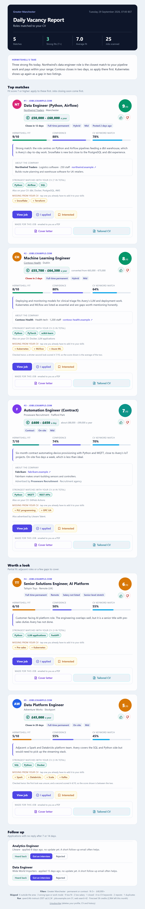
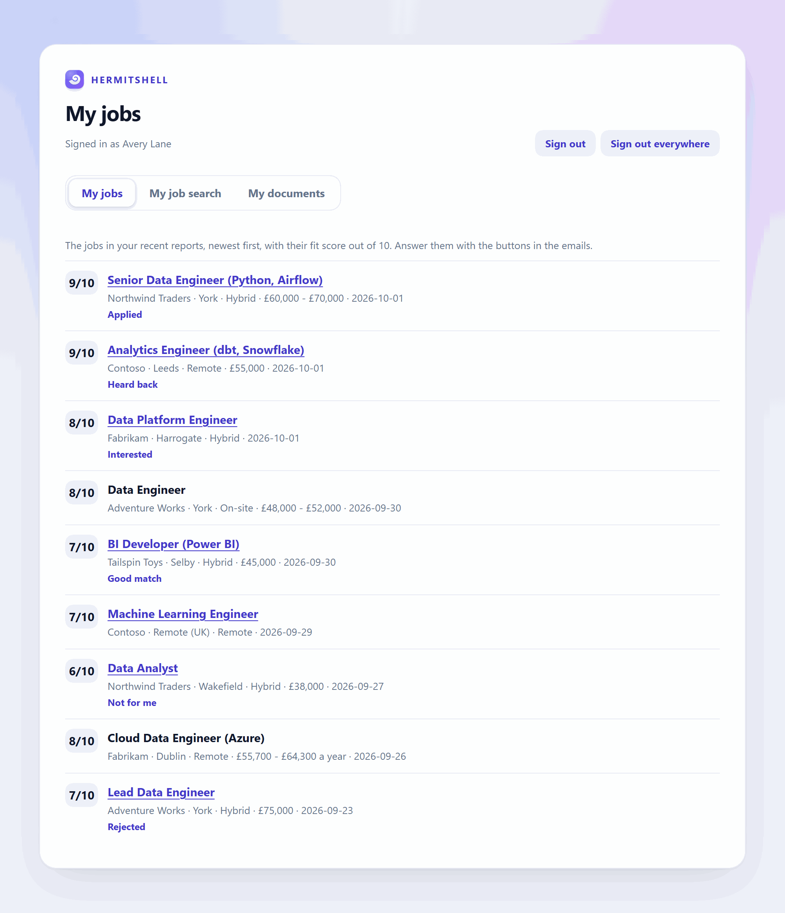
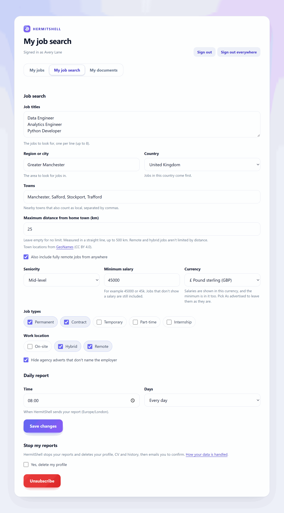
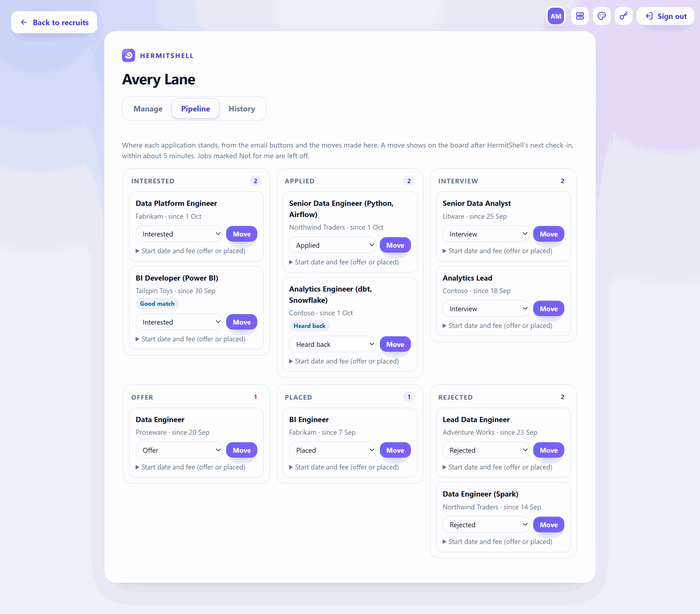
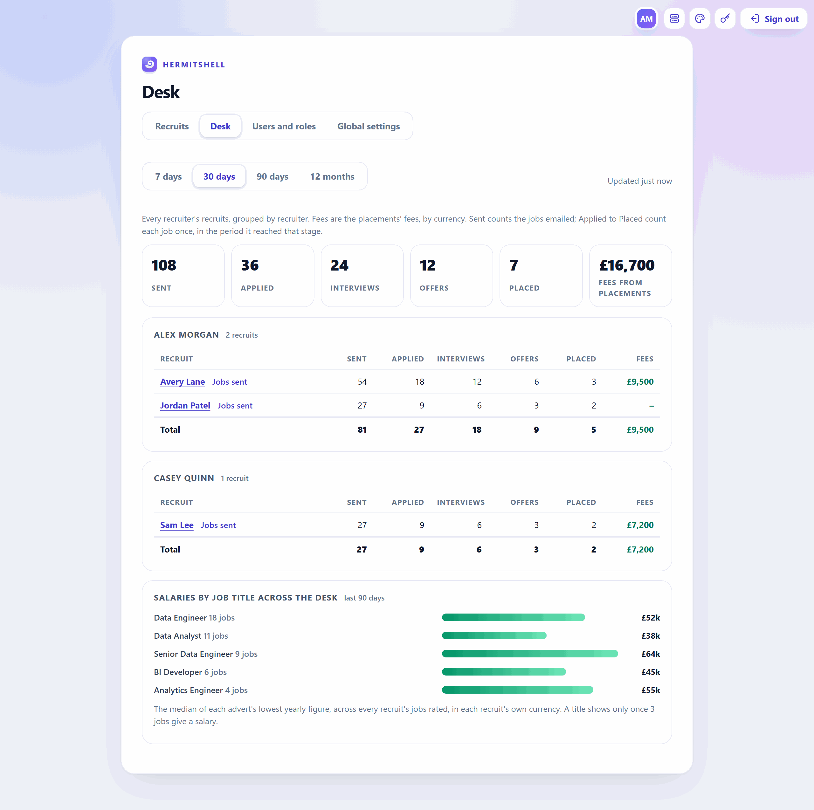
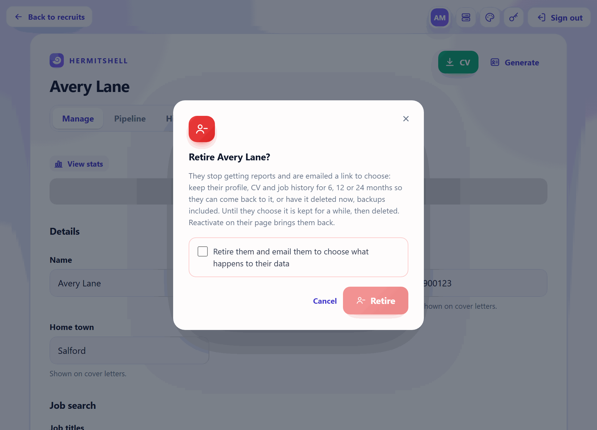
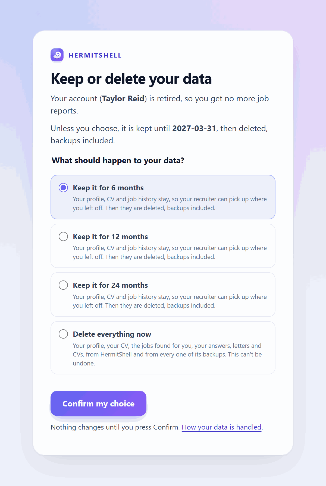

# HermitShell demo: a guided tour

A walk through what HermitShell does, in the order a recruitment desk meets it: setting up, inviting
recruits, finding them jobs, acting on the jobs, writing documents, and looking after their data. Every
step can be tried in the [demo image](demo-image.md), which has made-up people, made-up adverts and
recorded AI answers, so it needs no keys and no internet.

- [Try it yourself](#try-it-yourself)
- [1. The dashboard and setting up](#1-the-dashboard-and-setting-up)
- [2. The team and their roles](#2-the-team-and-their-roles)
- [3. Inviting recruits](#3-inviting-recruits)
- [4. A profile built from the CV](#4-a-profile-built-from-the-cv)
- [5. The recruiter's page and Send jobs now](#5-the-recruiters-page-and-send-jobs-now)
- [6. The daily report](#6-the-daily-report)
- [7. The recruit's own page](#7-the-recruits-own-page)
- [8. The Pipeline and interview prep](#8-the-pipeline-and-interview-prep)
- [9. Cover letters and tailored CVs](#9-cover-letters-and-tailored-cvs)
- [10. The desk, tasks, stats and history](#10-the-desk-tasks-stats-and-history)
- [11. Branding and Global settings](#11-branding-and-global-settings)
- [12. Retiring a recruit and their data](#12-retiring-a-recruit-and-their-data)
- [13. Privacy and security](#13-privacy-and-security)
- [Watch every journey run](#watch-every-journey-run)

## Try it yourself

```sh
docker run --rm --name hermitshell-demo --shm-size 1g \
  -p 127.0.0.1:8787:8787 -p 127.0.0.1:8025:8025 -p 127.0.0.1:8080:8080 \
  ghcr.io/metaheurist/hermitshell-demo demo
```

| Open | What it is |
| --- | --- |
| <http://localhost:8080> | The viewer: plays the tour below live, window by window |
| <https://localhost:8787/admin> | The dashboard (user `admin`; password: `docker exec hermitshell-demo cat /data/explore/.env.explore`) |
| <http://localhost:8025> | The inbox: every email HermitShell sends lands here |

The demo's people: admin Alex Morgan, manager Morgan Ellis, recruiters Riley Chen and Casey Quinn, and
recruits Sam Lee, Jordan Patel, Taylor Reid, Drew Harper and Avery Lane. Use `app` instead of `demo` to skip
the tour and click around yourself; see [Modes](demo-image.md#modes).

## 1. The dashboard and setting up

The dashboard lives on a Cloudflare Worker, so it is reachable from anywhere while the server running
HermitShell stays private. A new install opens on **Finish setting up**: connect HermitShell, set the email
server, add web search and AI model keys, and invite the first recruit.


Once set up, **Recruits** lists everyone with their status, recruiter, tags and last report, with search,
filters and a bulk bar.


## 2. The team and their roles

**Users and roles** adds staff. Admins see and change everything; managers see their team's recruits;
recruiters see only their own. Pages a role can't use are closed to it, not just hidden.


## 3. Inviting recruits

A recruiter makes an invite link (single use, with an expiry) and sends it. The recruit fills in their name,
email, town and the roles they want, then pastes a CV or uploads a PDF or Word file.

 

The CV and personal details are encrypted in the Worker before they are stored, with a key only the
HermitShell server can open.

## 4. A profile built from the CV

HermitShell collects the sign-up, and the AI model reads the CV. It writes a profile:
job titles to search for, skills, level and gaps. The recruit's region starts as their home town. The recruit
gets a welcome email listing what HermitShell will search for, and the admin is told about the new recruit.

 

## 5. The recruiter's page and Send jobs now

Each recruit has a page: details, where they want to work (region, towns, country, distance), titles,
salary, job types, report time, tags, notes and their CV.


**Send jobs now** runs the recruit's search straight away instead of at their daily time. The page shows the
progress while HermitShell searches the web and rates each advert.


## 6. The daily report

Each recruit gets one email a day with the jobs that fit, best first: a fit score, how sure the model is,
the skills that match, the gaps, salary, closing date and the real employer behind agency adverts.

 

Every job has buttons: **Interested**, **I applied**, **Not for me**, **Cover letter** and **Tailored CV**.
Each opens a page that says what will happen; nothing is saved until the recruit presses **Confirm**, so a
mail scanner opening the link changes nothing. A button that has been tampered with is refused.

 

## 7. The recruit's own page

With **Recruits' own page** switched on (Global settings, Features), recruits sign in at `/me` with a
link emailed to them (no password) to see the jobs HermitShell sent,
their letters and CVs, and to change their own job search.

 

## 8. The Pipeline and interview prep

**I applied** puts the job on the recruit's **Pipeline**, within minutes. The recruiter moves cards along as
things happen. At **Interview**, the card's **Interview prep** button makes a prep pack for that job (or HermitShell
makes one by itself, if switched on), kept on the card to download.



## 9. Cover letters and tailored CVs

From the email's buttons, or **Generate** on the dashboard, HermitShell writes a cover letter or a CV
tailored to the advert, as a PDF, and emails it. It first maps each of the advert's requirements to
the fact in the CV that shows it, then writes from that map, and checks the result: figures, titles or
employers that aren't in the CV are rejected and rewritten.

 

**Jobs sent** lists every job sent to a recruit with their answers and the documents made for it, ready to
download, with options for the letter's length and tone.


## 10. The desk, tasks, stats and history

- **Desk:** what needs doing across the recruits a person looks after (manager and recruiter views).
- **Tasks:** everything HermitShell is doing or has waiting, with a cancel button.
- **Stats:** per recruit, the jobs found, answers and applications over time.
- **History:** who did what, and when, for each recruit.

 

## 11. Branding and Global settings

**Theme** sets the agency's name, colours and logo, used on the dashboard, sign-up and privacy pages and the
emails. **Global settings** holds the email server, web search keys, AI model keys, the model and the
features that can be switched on and off. A key typed here is sealed by the Worker so only the server can
read it, and is never shown again.

 

## 12. Retiring a recruit and their data

When someone finds work, **Retire** stops their reports and emails them a choice: keep their data for 6, 12
or 24 months in case they look again, or delete everything now, backups included. **Reactivate** brings a
retired recruit back with their profile intact.

 

## 13. Privacy and security

- **Your own AI:** a model on your server (Ollama) reads CVs and adverts; cloud models are optional, used
  only when a key is added, with Ollama as the fallback.
- **No way in:** the HermitShell server only makes outgoing connections; the public part is the Worker.
- **Encrypted relay:** CVs, passwords and keys are stored in the Worker only as ciphertext only the server
  can open; requests between them are signed and can't be replayed.
- **Data rights:** a privacy page, unsubscribe, a retention choice on retiring, and deletion that reaches
  backups.


## Watch every journey run

The demo image's viewer shows each person's browser window live as the walkthrough runs: the admin, the
recruiter, the manager and the recruits, each with a caption of what they are doing. In `test` mode a panel
picks journeys to run and links to the report.


The same journeys run against a full local stack with the [exploratory walkthrough](exploratory-testing.md);
the [screenshots page](screenshots.md) has every page and email.
