# Screenshots

Every email, PDF and web page HermitShell produces, with what each part does. All of them use
fictional data: the example candidate Alex Morgan, made-up employers (Northwind Traders, Contoso
Health, Fabrikam...) and `example.com` addresses.

- [Daily report](#daily-report)
- [Weekly roll-up](#weekly-roll-up)
- [Cover letters and tailored CVs](#cover-letters-and-tailored-cvs)
- [A job emailed from the dashboard](#a-job-emailed-from-the-dashboard)
- [Profile emails](#recruit-emails)
- [Test emails](#test-emails)
- [Button pages](#button-pages)
- [Sign-up page](#sign-up-page)
- [Admin page](#admin-page)
- [Regenerating these images](#regenerating-these-images)

## Daily report

The email `job_scanner.py` sends each morning.
[Full-length version](images/emails/daily-report.png).


**Header.** Your region (`JOB_REGION_NAME`) and the run time, the report title and tagline
(`JOB_REPORT_TITLE`, `JOB_REPORT_TAGLINE`), then four figures: matches in this email, strong fits
(7 or more, in green), the average fit and how many jobs were rated this run.

**HermitShell's take.** A short summary the model writes over all the matches: what to apply for
first and which gaps keep coming up.

**Sections.** *Top matches* (fit 7+) come first and *Worth a look* (below 7, down to
`JOB_SCANNER_MIN_SCORE`) second. Inside each, jobs closing within three days go first. *Follow up*
lists jobs you marked **I applied** with no reply after 7 and 14 days.

### A job card


From top to bottom:

| Part | What it shows |
| --- | --- |
| Avatar | The employer's logo from its website, or coloured initials when none is found |
| `#1 · JOBS.EXAMPLE.COM` | Rank in this email and where the job was found |
| Title, company, location | The title links to the listing; the company links to its website |
| Salary | The pay as a headline, with the currency's symbol on its icon. Pay advertised in another currency is converted to the profile's, with the advertised figure beside it. Day and hourly rates also show a yearly estimate. Jobs clearly below `JOB_MIN_SALARY` never get here |
| Pills | Closing date (red within three days), employment type, work mode, level (or "Senior-level stretch"), posting age; "Salary not listed" when there is none |
| Fit circle | The final 0-10 score: green 8+, teal 7, amber 5-6, red below 5 |
| Meters | **HermitShell fit**, the model's **Confidence**, and **CV keyword match** (the share of technologies in the listing that are on your CV) |
| Reasoning | The model's one or two sentences on why it scored the job this way |
| About the company | Industry, size, website and a one-line description. For agency adverts it names the real employer and the agency separately |
| Strongest matches | Your three strongest matching skills in bold, the rest on one line |
| Missing from your CV | Skills the listing asks for that your CV lacks. Tap one you do have to add it ([how](feedback-worker.md#adding-missing-skills)) |
| Buttons | Thumbs up (**Good match**) and thumbs down (**Not for me**) beside the salary, under the score; **View job**, **I applied** and **Interested** below a divider; **Cover letter** and **Tailored CV** side by side in a "Made for this job" panel ([button pages](#button-pages)) |
| Notes | "Checked twice" when a stricter second look lowered the score, or when an unsure score was moved by a second look, and other agencies advertising the same job |

The buttons and tags only appear when the [feedback Worker](feedback-worker.md) is set up.

### On a phone

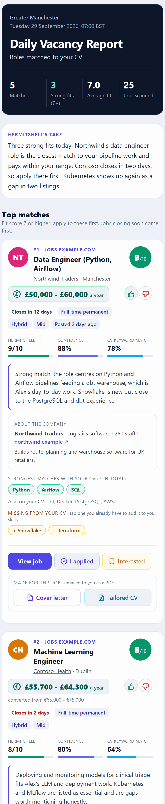

Below 540 pixels wide (Gmail's apps and other clients that read an email's styles) the margins and
padding shrink, the header's region and date stack, and the salary, tags and meters use the card's
full width. The logo or initials and the fit circle keep their size and shape, and the meters line
up even when a label takes two lines. Clients that ignore styles get the same layout with wider margins.

### Notices, CV additions and shortened entries


- **Check your sources** (amber) lists search providers that failed or found nothing, and a
  feedback Worker that didn't answer.
- **Added to your CV** (cyan) lists skills you added from the missing-skill tags that were merged
  into your CV this run.
- **More matches**: when the email would be clipped by Gmail (over about 100 KB), the
  lowest-ranked jobs become one-line entries instead of full cards. They keep the card buttons, with
  the same icons, at a smaller size.
- **Footer**: three short lines. **Filters** shows the area, job types, minimum fit and salary floor.
  **Skipped** shows how many jobs each filter removed, listing only the filters that removed some.
  **Run** shows the model, the sources and the web credits used. Below them is the
  **Unsubscribe** link. How scores and buttons work is explained once, in the welcome email and
  these docs, instead of in every report.

### No new matches


Sent when only follow-ups are due, or on every run with `JOB_SCANNER_EMAIL_WHEN_EMPTY=1`. The
**Heard back** and **Rejected** buttons update the application in your tracker.

## Weekly roll-up

`job_weekly.py`, Sundays at 18:00 by default.


The header shows jobs rated, jobs emailed, average fit and applications this week. Then:

- **Best of the week**: the five highest-scoring jobs emailed to you.
- **Applications**: everything you marked **I applied**, how long ago, and its status (Waiting,
  Heard back, Rejected), plus a count of your button presses this week.
- **Skills that keep coming up as gaps**: the most common missing skills, with how many
  listings asked for each.
- **Who is hiring**: the employers with the most roles this week.
- **Fit scores this week**: how the ratings spread over 9-10, 7-8, 5-6 and 0-4.
- **Source health**: postings found per source. Amber means a source had failed or empty runs.

## Cover letters and tailored CVs

Press **Cover letter** or **Tailored CV** on a job, confirm, and within about 10 minutes you get
an email with a PDF attached ([how it works](feedback-worker.md#cover-letters)).

<table>
<tr><th>Cover letter email</th><th>Cover letter PDF</th></tr>
<tr>
<td></td>
<td></td>
</tr>
<tr><th>Tailored CV email</th><th>Tailored CV PDF</th></tr>
<tr>
<td></td>
<td></td>
</tr>
</table>

The email repeats the job details (employer, agency, location, type, salary, closing date, fit),
your note from the confirmation page, and a preview: the letter's paragraphs, or the CV's
headline, profile and skills. The letter uses your name and `COVER_LETTER_CONTACT`; the CV only
reorders and rephrases what is already on your CV, keeping titles, employers and dates.

## A job emailed from the dashboard

**Send** on an opened job in the [jobs sent list](#the-jobs-sent-to-a-recruit) emails that job to the profile as
the card it had in the daily report, with its buttons working for that profile
([how it works](feedback-worker.md#jobs-sent)). The header gives the fit and how long is left to
apply, and says when the advert has already closed.

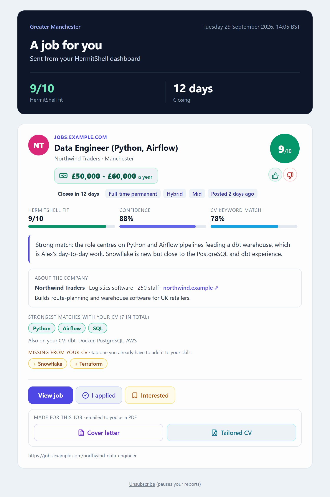

## Recruit emails

Sent by `profiles.py` when you use [recruits](feedback-worker.md#recruits-and-the-admin-page).

<table>
<tr><th>Welcome (to the new person)</th><th>New recruit (to you)</th></tr>
<tr>
<td></td>
<td></td>
</tr>
<tr><th>Unsubscribed (to you)</th><th>Goodbye (to the person who left)</th></tr>
<tr>
<td></td>
<td></td>
</tr>
</table>

- **Welcome** lists the job titles HermitShell will search for and the skills it read from the CV, so
  the person can reply if something is wrong. It is sent again as "Recruit updated" when they
  send a new CV.
- **Notices to you** share one layout, with a count of active and paused profiles and a
  **Manage recruits** link: new recruit, recruit updated, unsubscribed (with their feedback) and
  sign-ups that couldn't be applied.
- **Goodbye** is the last email a recruit gets: it confirms that their profile, CV and
  history are deleted and their name and email removed from the logs.

## Test emails

<table>
<tr><th>From the dashboard's test button</th><th><code>job_scanner.py --test-email</code></th></tr>
<tr>
<td></td>
<td></td>
</tr>
</table>

Both only check that the SMTP settings (`SMTP_HOST`, `SMTP_PORT`, `SMTP_USER`, `SMTP_PASSWORD`,
`SMTP_FROM`) can send. The setup wizard sends the second one at the end.

## Button pages

Every button in an email opens a page on the feedback Worker. Nothing is saved until you press
**Confirm**, so mail scanners that open links can't record answers.

<table>
<tr><th>Good match</th><th>Not for me</th><th>Interested</th></tr>
<tr>
<td></td>
<td></td>
<td></td>
</tr>
<tr><th>I applied</th><th>Heard back</th><th>Rejected</th></tr>
<tr>
<td></td>
<td></td>
<td></td>
</tr>
<tr><th>Cover letter</th><th>Tailored CV</th><th>Add to my skills</th></tr>
<tr>
<td></td>
<td></td>
<td></td>
</tr>
</table>

- The note box is optional. Notes on **Not for me** and **Good match** are shown to the model as
  examples of what you want; notes on **Cover letter** and **Tailored CV** guide what it writes.
- **Add to my skills** lists the job's missing skills with the one you tapped already ticked,
  plus a box for any others.
- **Cover letter** and **Tailored CV**, when one was made for that job in the last
  `COVER_LETTER_KEEP_DAYS` days (7 by default), offer it for download first. **Confirm: write a new
  cover letter** has a new one written anyway:

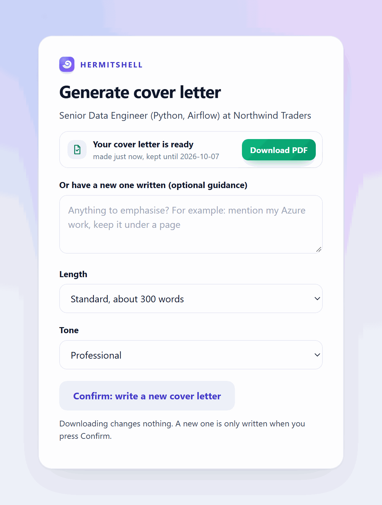

After **Confirm**:

<table>
<tr><th>Saved</th><th>Cover letter requested</th><th>Tailored CV requested</th></tr>
<tr>
<td></td>
<td></td>
<td></td>
</tr>
<tr><th>Skills added</th><th>No skill ticked</th><th></th></tr>
<tr>
<td></td>
<td></td>
<td></td>
</tr>
</table>

### Unsubscribe

<table>
<tr><th>Recruit</th><th>A report you got before your search moved</th><th>Confirmed</th></tr>
<tr>
<td></td>
<td></td>
<td></td>
</tr>
</table>

For a recruit it deletes the profile, CV and history. The link in a report you got before your own
job search moved to a recruit only pauses that recruit.

### Link problems

<table>
<tr><th>Changed or incomplete link</th><th>Older than 90 days</th><th>Profile deleted</th></tr>
<tr>
<td></td>
<td></td>
<td></td>
</tr>
</table>

"Link not valid" on every button usually means the Worker's `JOB_FEEDBACK_SECRET` differs from
the one in `.env` ([troubleshooting](feedback-worker.md#troubleshooting)).

## Sign-up page

`/join?i=<invite>`, the link you create on the admin page. Each link works once and expires after
7 days.

<table>
<tr><th>Form</th><th>Missing CV</th></tr>
<tr>
<td></td>
<td></td>
</tr>
<tr><th>Done</th><th>Used or expired invite</th></tr>
<tr>
<td></td>
<td></td>
</tr>
</table>

| Field | Used for |
| --- | --- |
| Full name | Their reports, cover letters and CVs |
| Email for your reports | Where their reports go; also stops one invite taking over another profile |
| Phone, where you live | Optional; shown on cover letters |
| Roles you are looking for | Turned into job titles and search queries by the model |
| CV file or pasted CV | PDF, Word .docx or text up to 5 MB; the pasted text is used when a file can't be read |
| Consent | Required; every report has an unsubscribe link that deletes the data |

### Privacy page

`/privacy`, linked from the consent box, the welcome email and the unsubscribe pages. It tells
people who join what is kept, why, where, for how long, how it is protected and how to have it
deleted ([data protection](configuration.md#data-protection)).


## Admin page

`/admin` on the feedback Worker, off until `ADMIN_PASSWORD` is set
([setup](feedback-worker.md#recruits-and-the-admin-page)).

<table>
<tr><th>Sign-in</th><th>Wrong password</th><th>Locked for 15 minutes</th></tr>
<tr>
<td></td>
<td></td>
<td></td>
</tr>
<tr><th>Behind Cloudflare Access, without a code</th><th></th><th></th></tr>
<tr>
<td></td>
<td></td><td></td>
</tr>
</table>

### Recruits


The Recruits and Users and roles pages grow with the window, up to 1320px wide, so the columns keep their
room. Under 900px each row becomes a card: the name on top, status and recruiter side by side, then the
buttons. On a phone everything is in one column.

<table>
<tr><th>Recruits on a phone</th><th>Users and roles on a phone</th></tr>
<tr>
<td>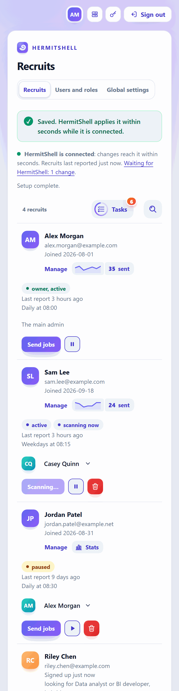</td>
<td>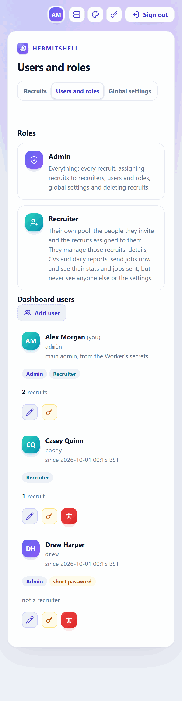</td>
</tr>
</table>

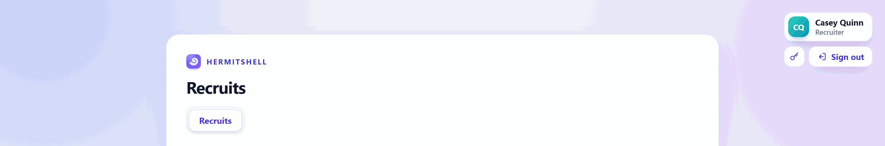

| Control | What it does |
| --- | --- |
| Status line | **HermitShell is connected** (green dot) while its live link is up, so changes reach it within seconds, then when it last reported its profiles. Without the link: when HermitShell last checked in, with the time in your timezone (`HERMES_TIMEZONE`). Also says how many changes are still **Waiting for HermitShell**, which opens **Tasks** for an admin. While a pause, resume, delete, assignment or send of yours is waiting, a **Saving** bar shows under it, the row carries a tag such as **pausing&hellip;**, and the page updates by itself until it is applied. A warning appears above it if HermitShell hasn't checked in for 45 minutes |
| **Tasks** (loading circle + number, admins only) | Opens the [task list](#tasks): everything HermitShell is doing or has waiting. The ring turns while something runs and the number in the corner says how many tasks there are |
| Search (magnifying glass) | Slides out a search box. Type part of a name, email, place, status (**paused**, **scanning**, **no cv**) or recruiter and press Enter: only the recruits with every word are listed, with **1 of 3 recruits** above the table. Searching a recruiter lists them first, followed by all their recruits. **&times;** shows everyone again |
| **pending** (orange) | Someone who has sent the invite form. They stay in the table, with when they signed up and what they're looking for, while HermitShell reads their CV, then the row becomes their profile |
| Tag pills | The recruit's tags beside their name; pressing one lists only the recruits with it (**2 tagged**, **Show everyone**). Searching a tag finds them too |
| Recruit, Status | Name, email and the date they joined, **no CV** when there is none yet; active or paused; **scanning now** while a report runs; when the last report ran (hover for the exact time) and the report time, **Daily at 08:00** or **Weekdays at 08:15** |
| **Send jobs** | Runs that recruit's report straight away and emails it when the scan finishes, even if nothing new turned up. Shows **Scanning…** while a report runs; missing without a CV |
| **Manage** | Opens [that profile's page](#a-recruits-page): details, job search, report time and CV |
| Stats line (the little chart) | This week's jobs sent, day by day; opens [that profile's stats and charts](#a-recruits-stats) |
| **24 sent** | How many jobs were sent this week; opens [the list of those jobs](#the-jobs-sent-to-a-recruit) |
| Recruiter + **Assign** (admins only) | The recruiter's initials and a list showing whose pool the recruit is in, or **?** and **Unassigned**. Pick another recruiter and **Assign** appears next to the list |
| Pause / play button | Pauses or resumes that recruit's reports (hover says which) |
| Tick box (left of the name) + bar | Ticking recruits brings up a bar under the list with how many are ticked and **Pause**, **Resume**, **Send jobs now** and, for admins, a recruiter list with **Assign**. Up to 25 at a time; the note after says how many were done and how many skipped (not yours, already paused or active, already that recruiter's, or asked for jobs in the last minute). Without `:has` support in the browser the bar is always shown |
| Bin button (red, admins only) | Opens a window to confirm deleting the recruit. Tick **Delete their CV and history** and press **Delete** to remove their CV and history from your server; **Cancel** or &times; closes it |
| **Recruits** / **Users and roles** / **Global settings** tabs | Switch between the recruits, [who can sign in](#users-and-roles) and the [settings shared by the whole tool](#global-settings). Recruiters only have **Recruits** |
| Invite someone + recruiter list + **Create invite link** | Makes a one-time `/join` link; the note is only for you. Admins pick whose recruit the person becomes; a recruiter's invites join their own pool |
| **Revoke** | Cancels an unused invite |
| Badge + key + **Sign out** (top right) | Your initials, name and roles, on every dashboard page (just the initials, above the page, on narrower windows, and on Recruits and Users and roles below 1860px). The key button opens **Change password**: your current password and the new one twice; you stay signed in here and are signed out everywhere else. For the main admin it shows the `wrangler secret put ADMIN_PASSWORD` command instead. Signing out ends that user's sessions |
| Server button (admins only, before the key) | Pointed at or tabbed to, opens a panel with the machine HermitShell runs on (CPU and load, memory, each GPU and the disk, with bars that turn amber from 70% and red from 90%), the AI models in the order they are asked with their model and state, the last answer and **Model settings** |

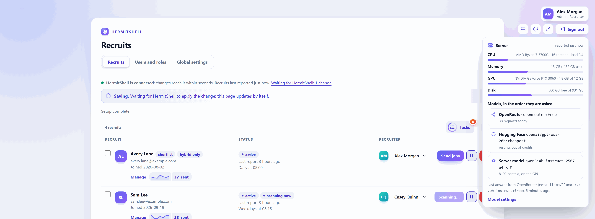

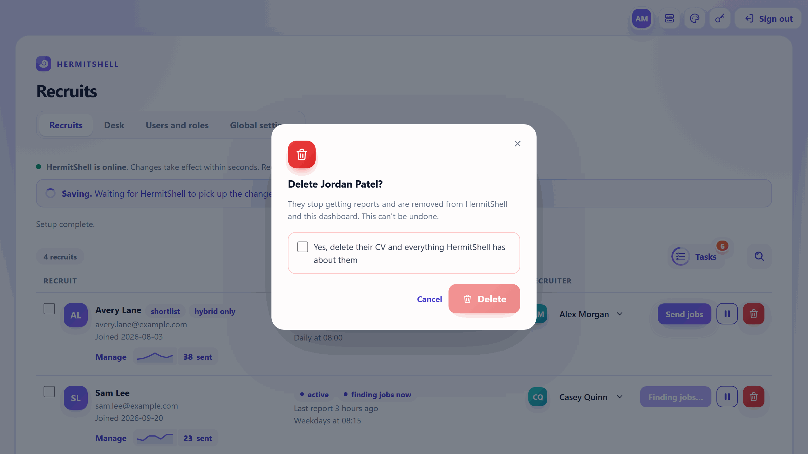

<table>
<tr><th>Searching for a recruit</th><th>Searching for a recruiter</th></tr>
<tr>
<td>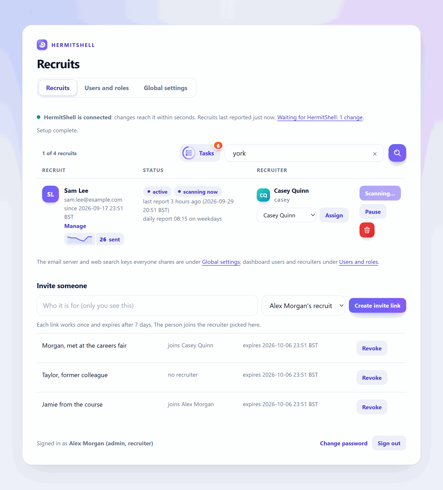</td>
<td>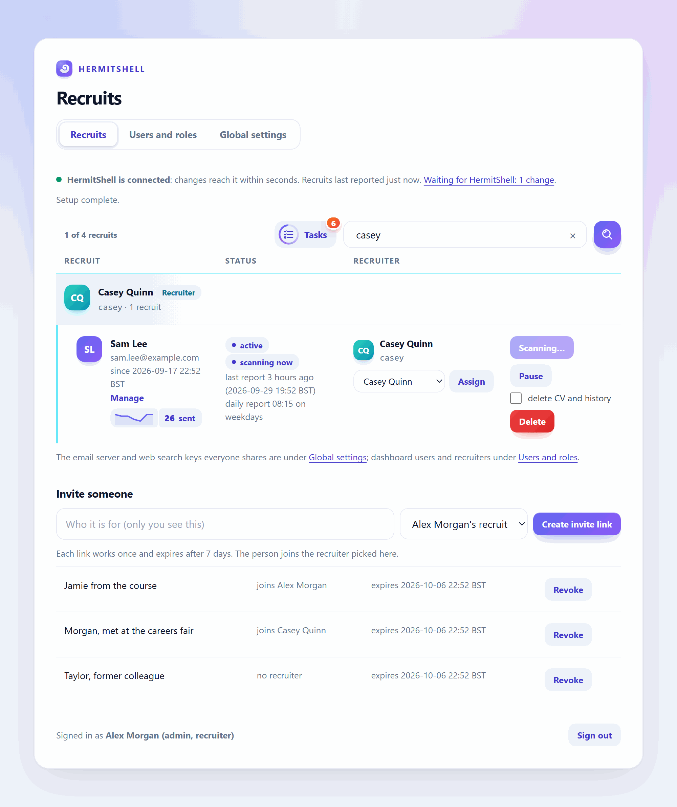</td>
</tr>
</table>

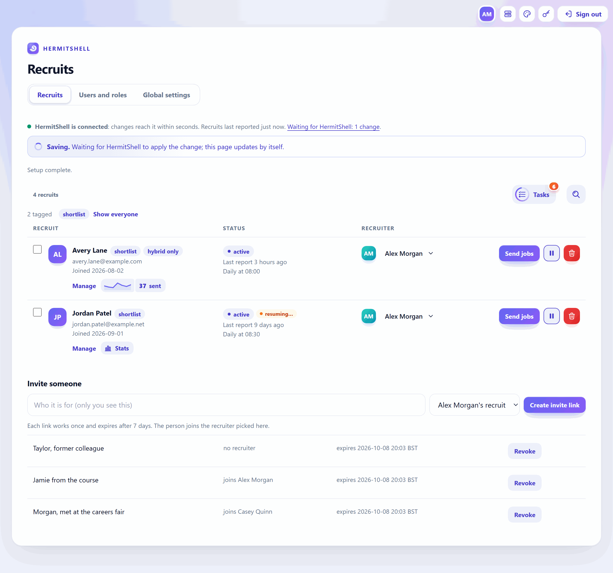

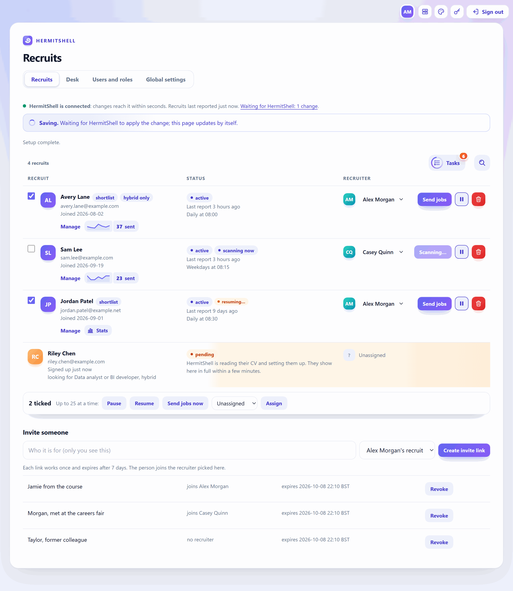

### Users and roles

`/admin/users`, admins only: the two roles and everyone who can sign in to the dashboard.

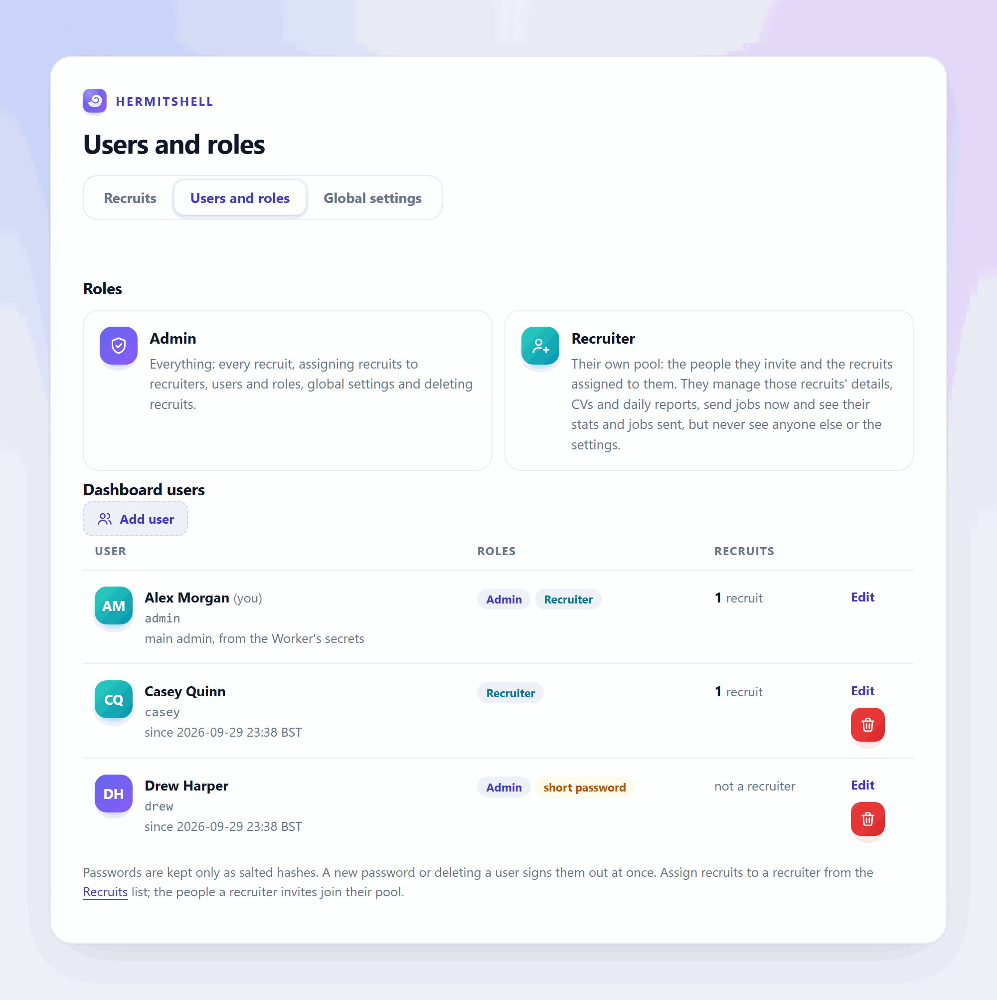

| Control | What it does |
| --- | --- |
| Role cards | **Admin**: everything. **Recruiter**: only their own pool, the people they invite and the recruits assigned to them |
| Users table | Each user's name, username, roles, how many recruits they have, and **short password** when their password is under 12 characters. The main admin (`ADMIN_USER`) is always first |
| **Add user** | Opens a window for a name, username, password and roles |
| **Edit** (pencil) | Changes the name and roles. On your own row it adds or removes your Recruiter role |
| **Reset password** (key) | Opens a window for a new password, typed twice. The user is signed out everywhere at once; tell them the new password yourself. On your own row the key opens **Change password** instead; not on the main admin's row |
| Bin button (red) | Opens a window to confirm; tick the box and press **Delete** to sign the user out, delete their unused invites and leave their recruits unassigned |

<table>
<tr><th>Add user</th><th>A recruiter's view</th></tr>
<tr>
<td>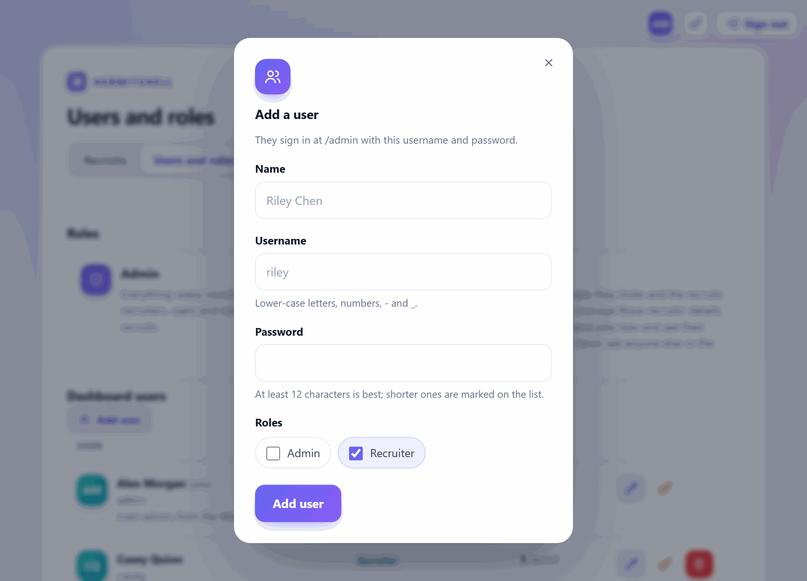</td>
<td>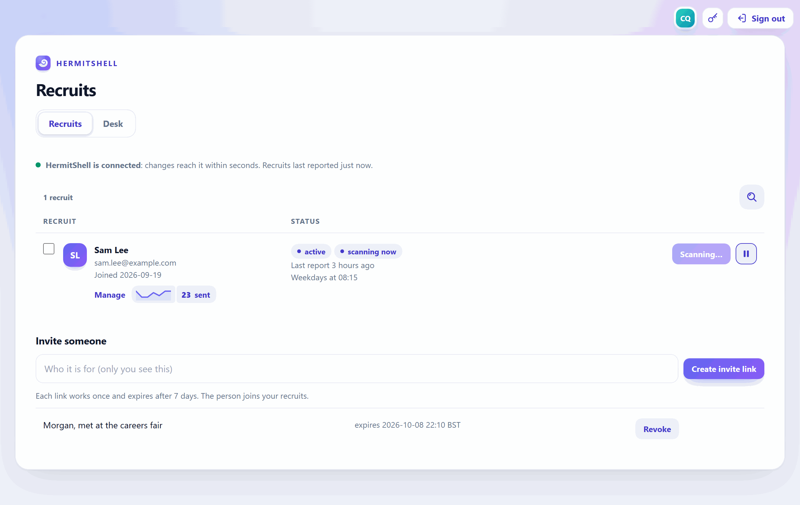</td>
</tr>
<tr><th>Reset password</th><th>Change password (a recruiter)</th></tr>
<tr>
<td>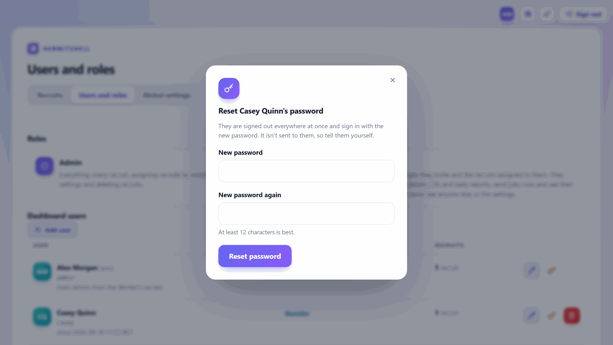</td>
<td>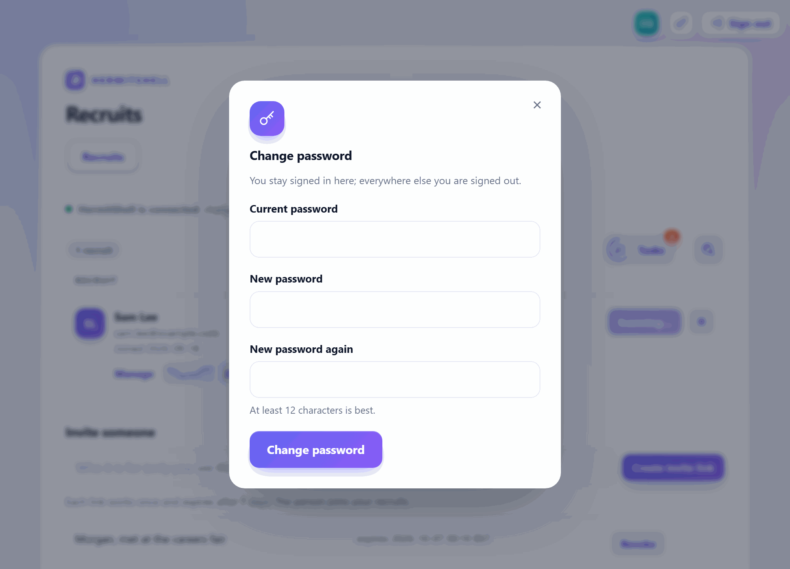</td>
</tr>
</table>

A recruiter sees only the **Recruits** tab, only their own recruits and invites, and no Recruiter
column, delete buttons, checklist or settings. Opening anyone else's page answers **Recruit not
found**; admin pages answer **Admins only**.

<table>
<tr><th>Right after setup: the checklist</th><th>Before HermitShell has reported</th><th>New invite link</th></tr>
<tr>
<td></td>
<td></td>
<td></td>
</tr>
</table>

The checklist stays until HermitShell has connected, the email server is set and a test worked, a web
search key is in, and the first recruit has joined (its item links to **Create invite link**). **HermitShell could not apply** lists changes
HermitShell rejected in the last day, with the reason.

### Tasks

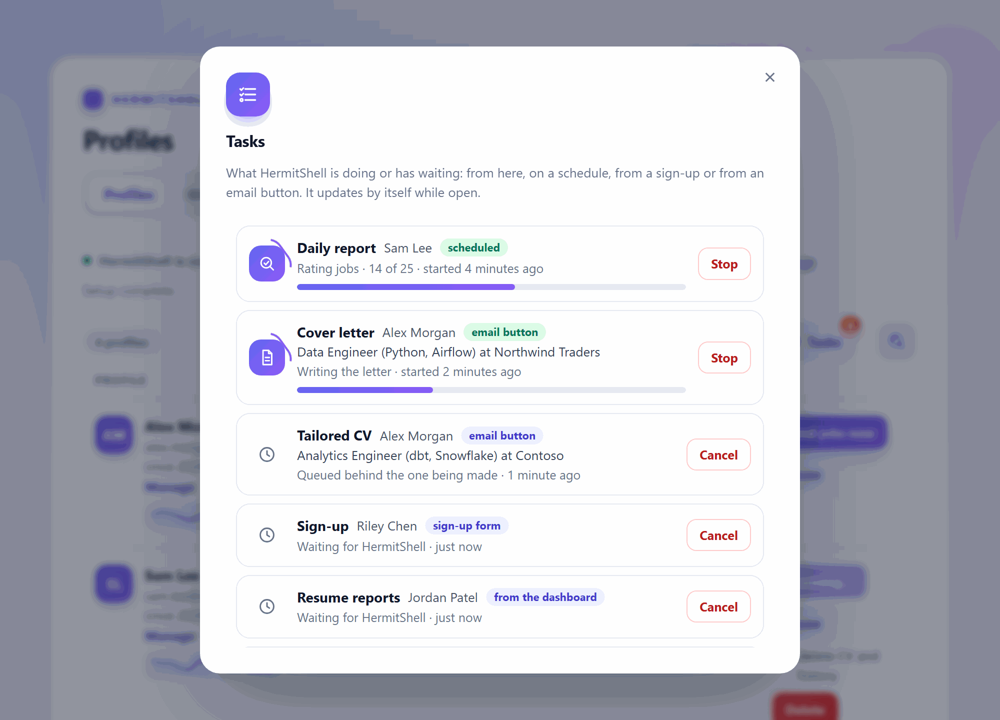

| Part | What it shows |
| --- | --- |
| Running tasks (loading circle round the icon) | A daily report or one sent now, with its stage (**Searching job boards and the web**, **Rating jobs**, **Writing the email**…), **14 of 25** and a bar while jobs are rated; a cover letter or tailored CV being written, with the job and employer |
| Waiting tasks (clock) | Requests queued behind the one being made, dashboard changes, sign-ups and resume requests HermitShell hasn't picked up yet, and email-button requests it hasn't fetched |
| Chips | Where the task came from: **scheduled**, **from the dashboard**, **email button**, **sign-up form** or **unsubscribe link** |
| **Stop** | Stops a running report (nothing is emailed and it runs again at its next time) or the letter being written. The row says **Stopping…** until HermitShell confirms |
| **Cancel** | Drops a waiting task. An email-button request is removed before HermitShell sees it, or skipped if it already has it. Stops and cancels are written in the recruit's **History** with who pressed them |

The list refreshes by itself while the window is open. Answers to the email buttons (Interested,
Applied…) are never listed and can't be cancelled here.

### Global settings

`/admin/settings`: the email server, web search keys and AI models every recruit uses.


| Control | What it does |
| --- | --- |
| Email server + **Save email server** | SMTP server, port, username, password and sender for everyone's emails. The password box stays empty; leave it empty to keep the saved password |
| **Send a test email** | Sends a test to the address typed (default: yours); the result shows under Email server after HermitShell's next check |
| **Go back to the .env email settings** | Shown when the email server was set here; undoes it |
| Web search API keys | One row per provider (Firecrawl, Tavily, Scrapfly): **set here** or **from .env**, the start and end of the key, the credits left, and Firecrawl's backup keys. These keys are used for every recruit |
| A provider, pressed | Opens its keys in the order they are tried: each one's start and end, a bar of the credits left (amber under 40%, red under 15%), the plan, when it resets and when HermitShell last checked, or why it couldn't. Pressed again, it closes |
| **Add key** / **Change** | Opens a window to pick the provider and paste the key. Firecrawl takes several keys, comma separated |
| **Use the .env key** | Shown next to a key set here; goes back to the one in `.env` |

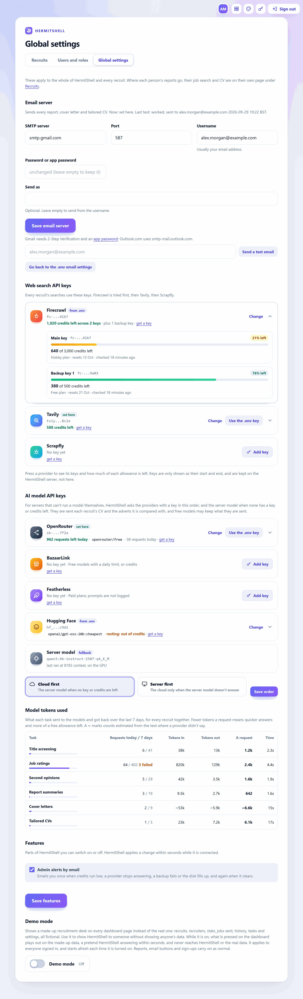

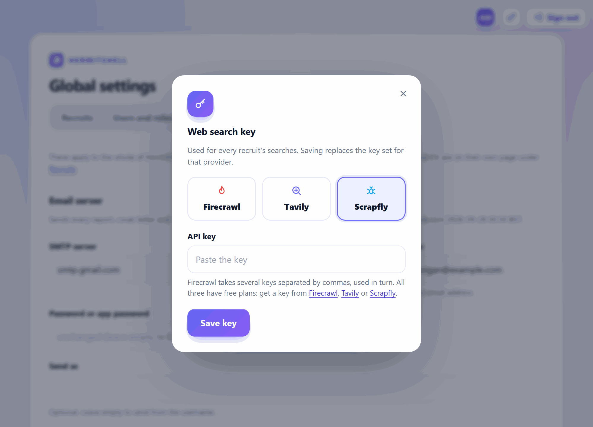

Keys are shown only as `fc-...1234`. Keys typed here are encrypted for your server before they are
stored, and removed from the Worker after 2 days if HermitShell hasn't collected them.

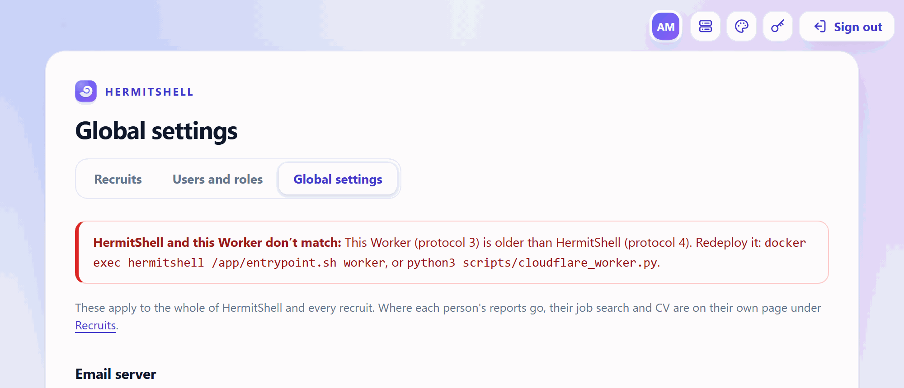

When HermitShell and the Worker are different versions, the dashboard and Global settings say which is
older and how to update it ([why](feedback-worker.md#how-it-stays-safe)).

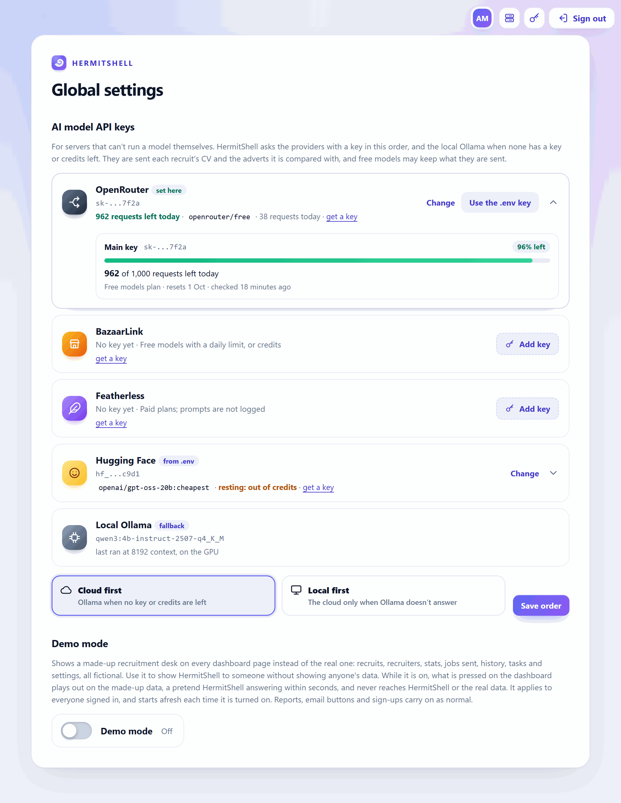

| Control | What it does |
| --- | --- |
| AI model API keys | One row per cloud provider (OpenRouter, BazaarLink, Featherless, Hugging Face) with its icon: **set here** or **from .env**, the start and end of the key, what is left, the model and whether it is **ready**, how many requests it answered today or why it is **resting** (out of credits, daily limit reached, key rejected). Pressed, it opens the key's usage like a web search key. Without a key, what the provider offers and **get a key** |
| **Add key** / **Change** | Opens a window to pick the provider, paste its key and, optionally, a model; blank keeps the current key or model |
| **Server model** | The model the server's Ollama runs, where it last ran, the model that suits the machine when that differs, and whether it is asked first or is the fallback |
| **Cloud first** / **Server first** + **Save order** | Cloud first asks the providers with a key in turn and the server model when none has a key or credits left; Server first uses the cloud only when the server model doesn't answer |

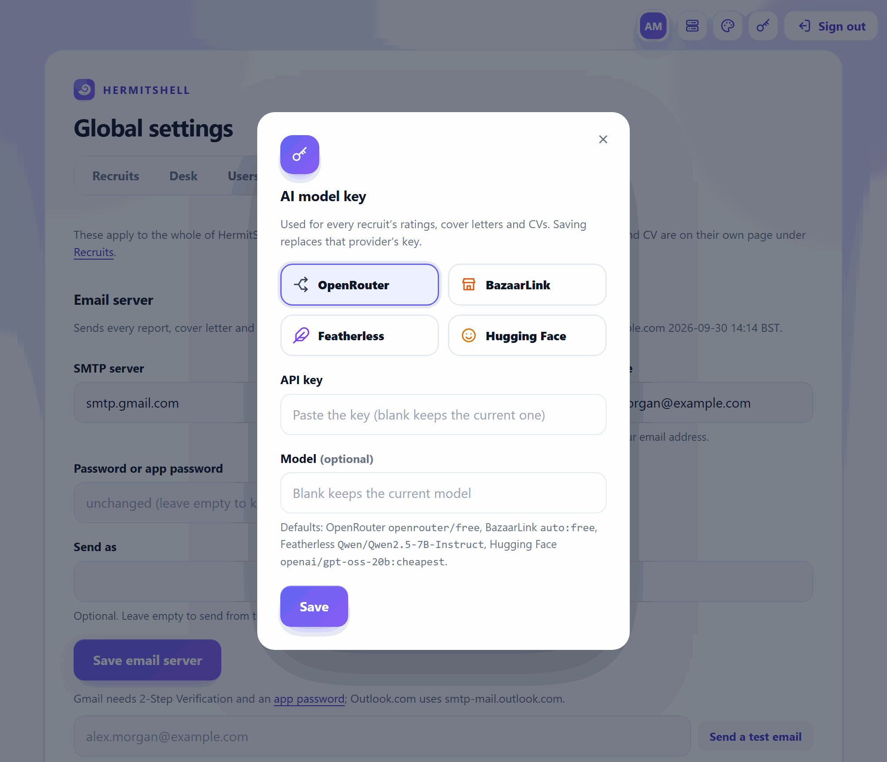

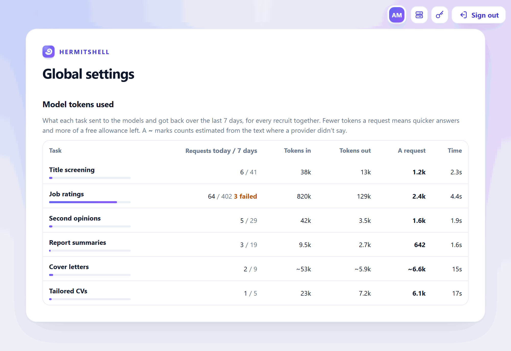

| Control | What it does |
| --- | --- |
| **Model tokens used** | One row per task that asked a model anything in the last 7 days: requests today / over the week and any that failed, tokens in and out, tokens a request and the average time, with a bar for its share of the week's tokens. **~** marks counts estimated from the text ([more](feedback-worker.md#model-tokens-used)) |

#### Features

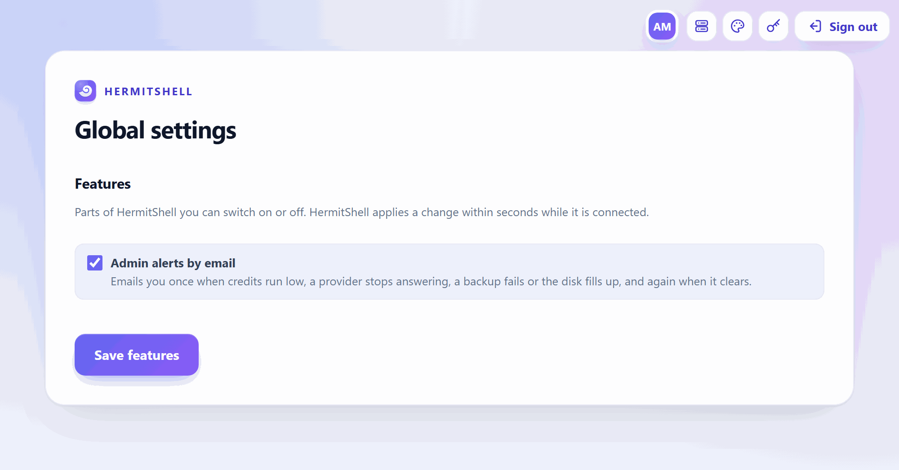

| Control | What it does |
| --- | --- |
| Feature switches | One per optional feature HermitShell reports, with what it does. **Admin alerts by email** emails the admin when credits run low, a provider stops answering, a backup fails or the disk fills up, and again when it clears ([more](configuration.md#admin-alerts)) |
| **Save features** | Queues the switches for HermitShell, which applies them within seconds while connected |

#### Demo mode

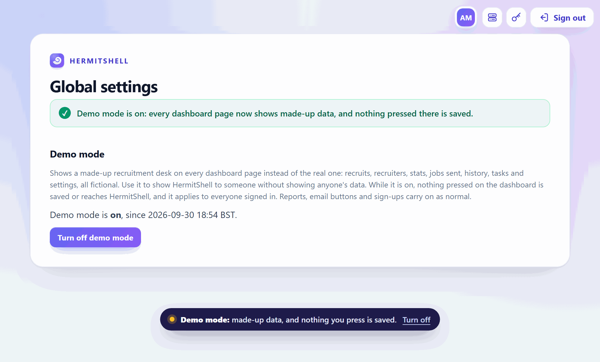

| Control | What it does |
| --- | --- |
| **Demo mode** switch | Admins only; shows Off, or On and since when. Every dashboard page shows a made-up desk for everyone signed in; presses play out on it (letters and CVs get made, skills added, recruits paused) but reach neither the real data nor HermitShell ([more](feedback-worker.md#demo-mode)) |
| Demo mode ribbon | At the foot of every page while it is on; admins get a **Turn off** link |

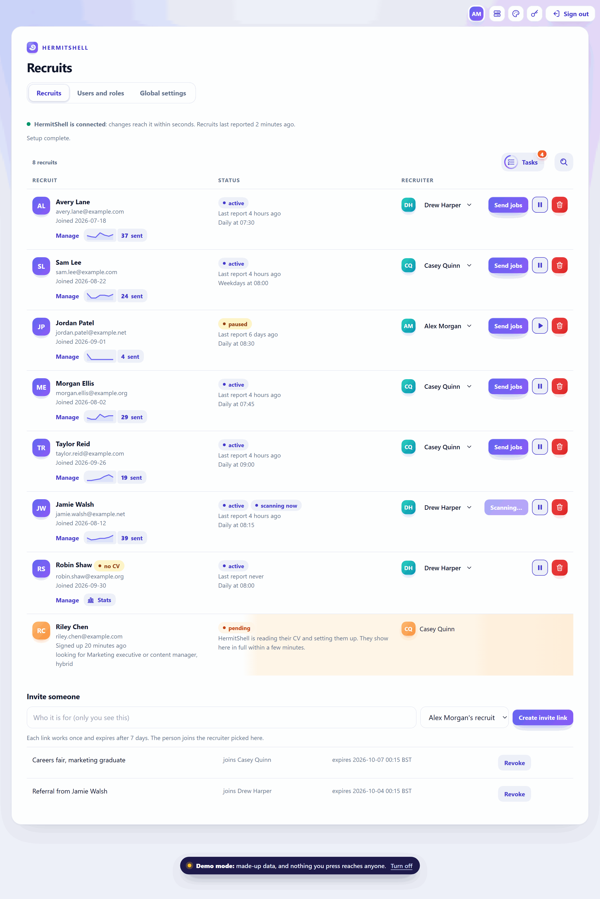

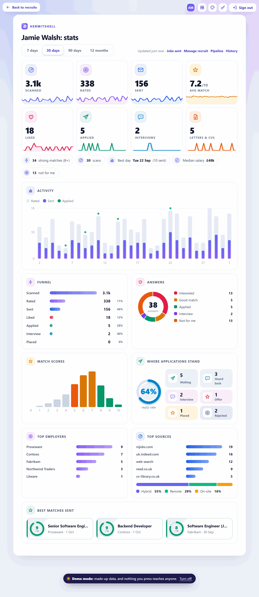

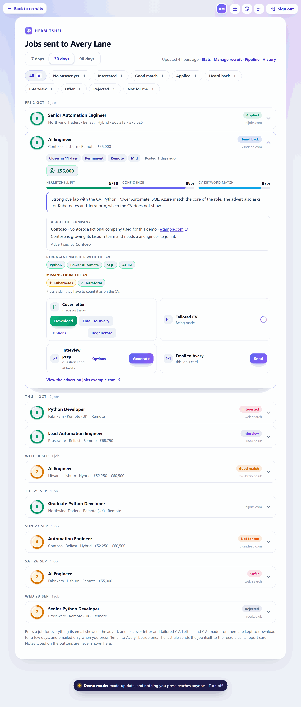

### A recruit's page


| Section | What it sets |
| --- | --- |
| **Back to recruits** | Floats in the top-left corner while you scroll |
| **CV** / **Generate** | Top right of the card: **Generate** makes their CV from the one uploaded (every role, not tailored); **CV** downloads it and only shows once one is made ([more](feedback-worker.md#a-recruits-page)) |
| **Manage** / **History** | The page's own tabs: this page and [its timeline](#a-recruits-history); Users and roles and Global settings are only on the dashboard |
| **View stats** | Opens [this profile's stats](#a-recruits-stats) |
| Status box | Under the tabs: **Up to date**, **Waiting for HermitShell** while a save is queued (it checks again by itself), **Applied by HermitShell**, **Scanning for jobs since…** while a report runs, or why a change couldn't be applied |
| Details | Name, the email address reports go to, phone and home town (for cover letters) |
| Job search | Job titles (up to 8), region or city (used in web searches), country from a list (a hand-set code not in the list is kept as its own option), towns, remote elsewhere, seniority, minimum salary (empty = none), salary currency (a list; salaries in other currencies are converted to it), employment types, work location, hiding unnamed agency adverts |
| Daily report | The time and days (every day or weekdays) HermitShell sends this profile's report; each profile's report is its own scheduled job |
| **Save changes** | One button for details, job search and report time; only the fields you changed are sent |
| **Send jobs now** | Runs the report now instead of at the daily time ([more](feedback-worker.md#send-jobs-now)) |
| Notes: **Tags** + **Save tags** | Up to 8 tags, separated by commas, shown as pills on the recruits list ([more](feedback-worker.md#notes-and-tags)) |
| Notes: **Add a note** + **Add note** | A note for you and the other recruiters, newest first with who wrote it and when; **Delete** for its writer and admins |
| CV + **Upload CV** | A new CV file or pasted text; HermitShell rebuilds the profile and skills from it and emails a summary |

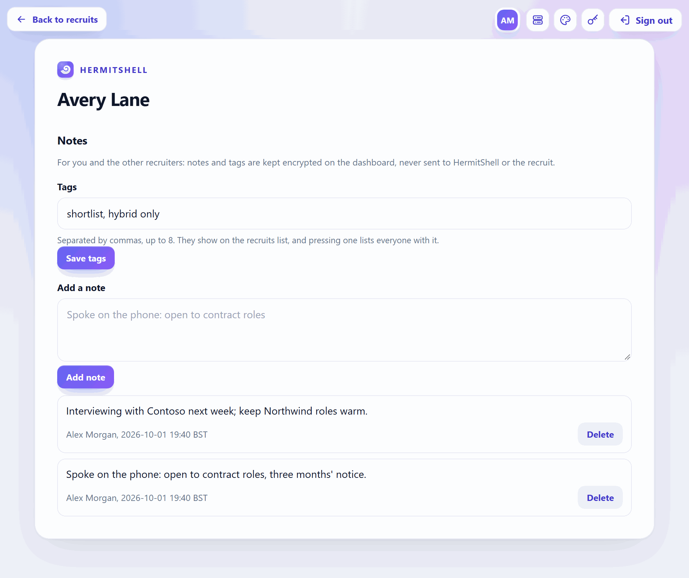

<table><tr><th>Just saved</th><th>Someone else changed the same field</th></tr>
<tr><td></td>
<td></td></tr></table>

After **Save changes** the form keeps the saved values (the page lays every change still waiting
for HermitShell over what it last reported) and the status box follows it until it is applied. If
someone else changed the same field since you opened the page, nothing is saved: the box lists each
clashing field with both values and your version stays in the form, so **Save changes** again keeps
yours. Changes to different fields are both kept.

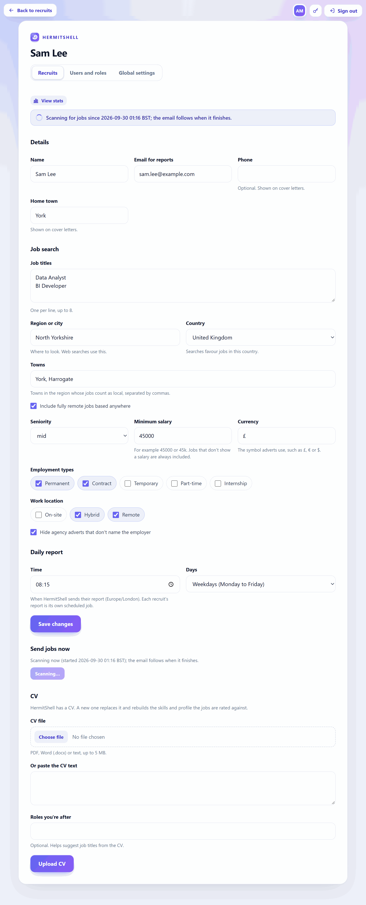

*While a report runs (here after **Send jobs now**), the status box says when the scan started and
the button waits until it has finished.*

<table><tr><th>Generate pressed</th><th>Their CV made and kept</th></tr>
<tr><td>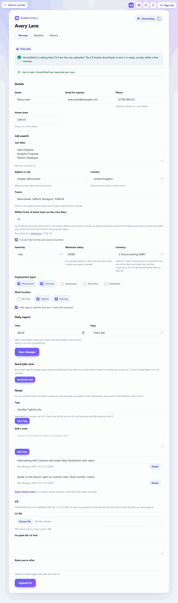</td>
<td>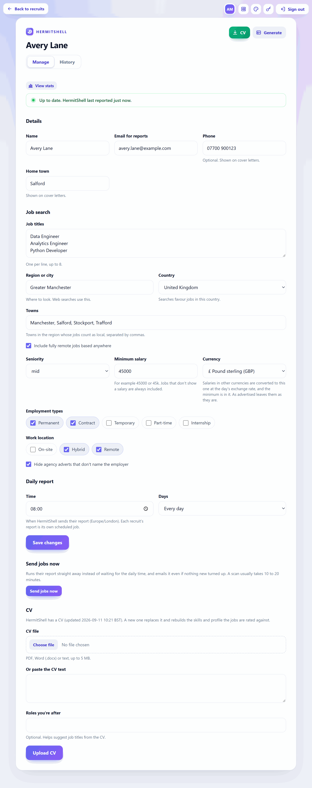</td></tr></table>

*The CV stays until **Generate** replaces it or the recruit unsubscribes or is deleted.*

### A recruit's history

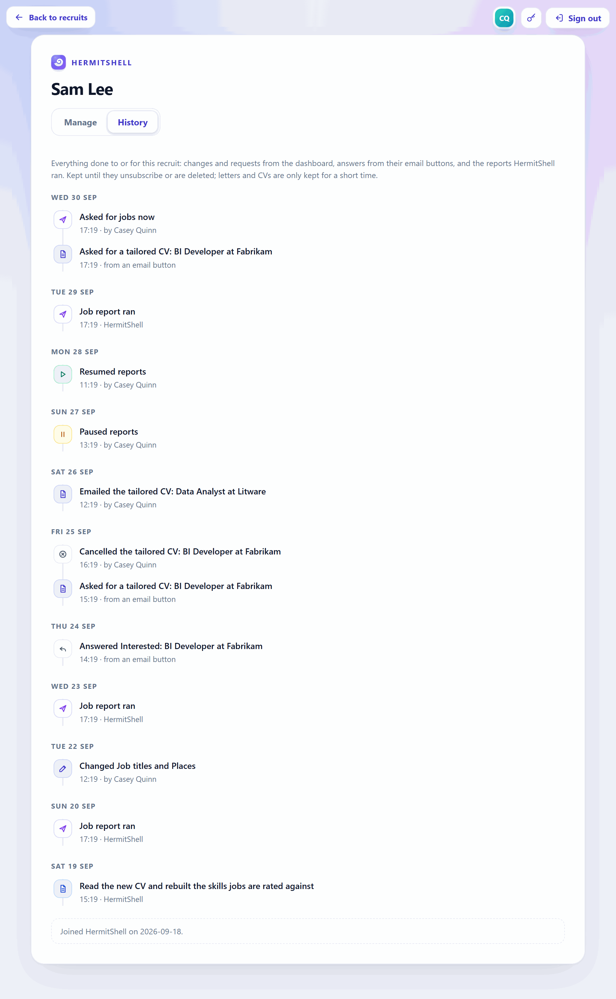

`/admin/history?u=<id>`, the **History** tab: everything done on the account, newest first and grouped
by day. Each entry says who did it (an admin or recruiter by name, the recruit **from an email button**,
or **HermitShell** for reports that ran and CVs it read). A cover letter or tailored CV asked for or
emailed has a green **Download** button while the document is still kept (7 days by default). The pills
at the top switch months; the oldest ends with the day they joined. It is kept until they unsubscribe or are deleted
([more](feedback-worker.md#history)).

### A recruit's stats

`/admin/stats?u=<id>`: one profile's numbers at a glance. Hover a bar or ring segment for its figures.

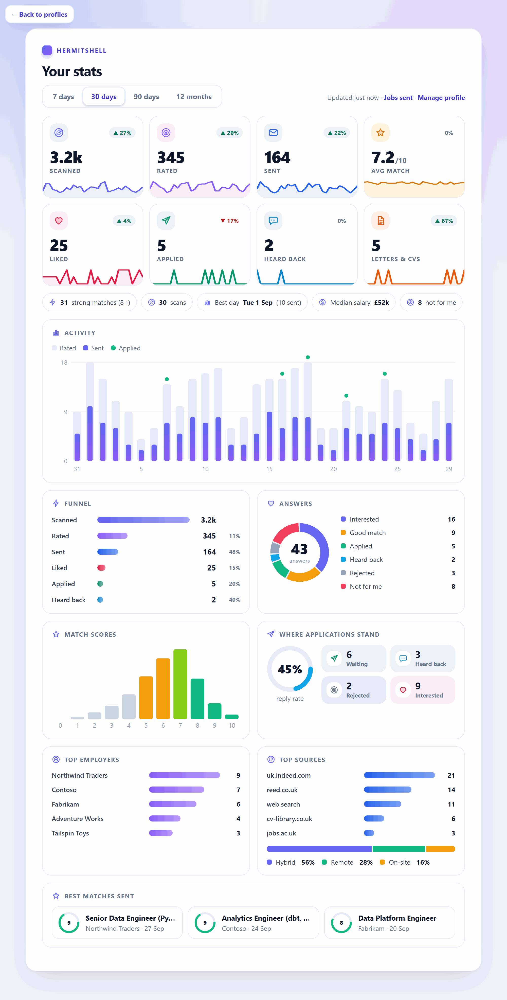

| Part | What it shows |
| --- | --- |
| **7 days** / **30 days** / **90 days** / **12 months** | The period every tile, chip and chart covers (except **Where applications stand**) |
| Tiles | Scanned, Rated, Sent, Avg match (out of 10), Liked, Applied, Heard back, Letters & CVs; a line of the period and the change against the period before (green up, red down) |
| Chips | Strong matches (8+), scans, the best day, week or month, median salary of the jobs sent (in the profile's currency), "not for me" presses |
| Activity | Jobs rated (light) and sent (dark) per day, week or month; green dots for applications |
| Funnel | Scanned, rated, sent, liked, applied, heard back, and the share kept at each step |
| Answers | The buttons pressed in the period, as a ring |
| Match scores | How many jobs rated scored each mark from 0 to 10 |
| Where applications stand | Each job's latest answer, over all time: waiting, heard back, rejected, interested; the reply rate |
| Top employers / Top sources | Where the jobs sent came from, and their hybrid, remote and on-site split |
| Best matches sent | The three highest scores of the period |

<table><tr><th>90 days, weekly bars</th><th>A new recruit, 7 days</th><th>Before HermitShell sends stats</th></tr>
<tr><td>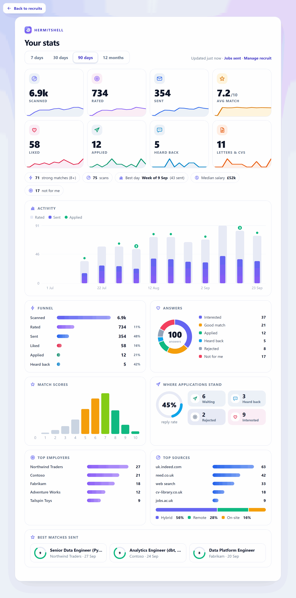</td>
<td>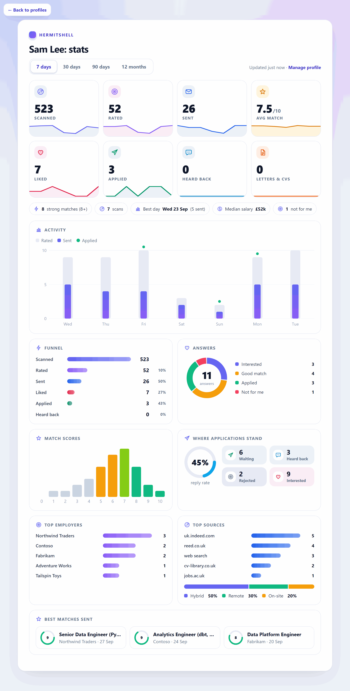</td>
<td>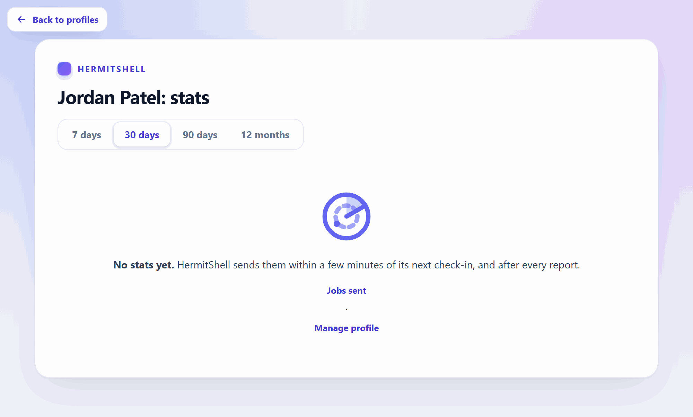</td></tr></table>

The **Jobs sent** link at the top opens the list of the jobs behind these numbers.

### The jobs sent to a recruit

`/admin/sent?u=<id>`: every job in that profile's reports, newest first, grouped by day. The
dashboard's **24 sent** button opens it for this week.

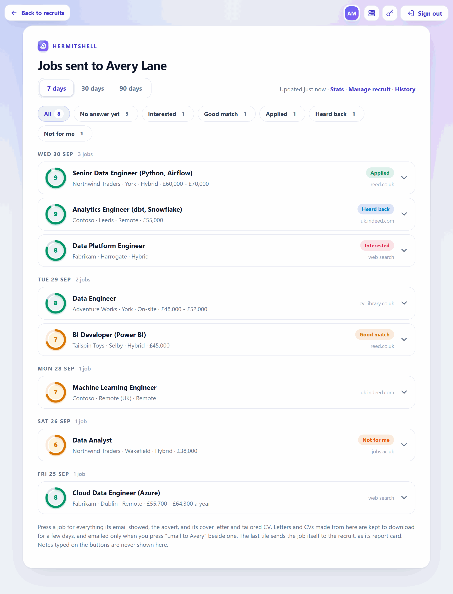

| Part | What it shows |
| --- | --- |
| **7 days** / **30 days** / **90 days** | The period listed. HermitShell sends the last 90 days, up to 150 jobs |
| Answer filters | **All**, **No answer yet** and each button pressed (**Applied**, **Heard back**, **Interested**…), with how many jobs have it. The filter stays when you change the period |
| Score ring | The job's match out of 10 (green 8+, lime 7, amber 5-6) |
| Title, employer, place, work mode, salary | As in the email. Press the row (or its arrow) to open the job's full card |
| Answer tag, source | The last button pressed on that job, and where it was found |
| **Stats** / **Manage recruit** | Back to the charts, or to the recruit's settings |

Notes typed on the buttons' confirmation pages are never shown.

An opened job shows what its email card did, its cover letter and tailored CV, and a button to email
it to the profile:

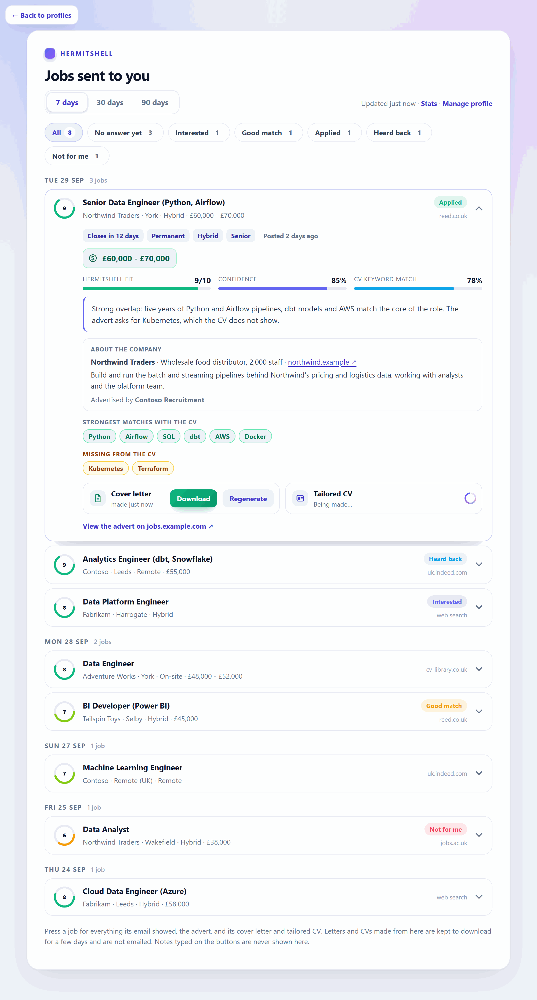

| Part | What it shows |
| --- | --- |
| Tags | Closing date, contract type, work mode, seniority and when it was posted |
| Salary | The pay as the email showed it, with its currency's symbol on the icon |
| **HermitShell fit** / **Confidence** / **CV keyword match** | The score out of 10, how sure the model was, and the share of the advert's skills your CV shows |
| Why | Why it was rated a fit, with anything it lacks (contact details and your name are removed) |
| **About the company** | The employer, what it does, its website, what the role is, and the agency when one posted it |
| **Strongest matches** / **Missing from the CV** | The skills found, and the ones the advert wants that your CV doesn't show. Press a missing skill the profile has (**+**) to count it as on the CV, as the email's missing-skill tag does: it shows dashed with a tick until HermitShell's next stats update, then with a solid tick |
| **Cover letter** / **Tailored CV** | **Generate** has one made (not emailed), shown with a loading circle until it is ready. **Download** gets the one made in the last `COVER_LETTER_KEEP_DAYS` days (7 by default), from here or an email button; **Email to Sam** (**Email to you**) has HermitShell email that same PDF to the profile, showing **Emailing to Sam…** until it has gone; **Regenerate** replaces it. **Options** picks the length and tone a new cover letter is written in and, for either, takes an optional note (**Anything to stress?**, up to 300 characters); the history says there was a note, not what it said |
| **Email to Sam** (**Email to you**) | **Send** has HermitShell email the job to the profile as its report card, with a loading circle while it goes; then **Emailed to Sam** with when, and **Send again** |
| **View the advert** | Opens the advert in a new tab, when the report had a link |

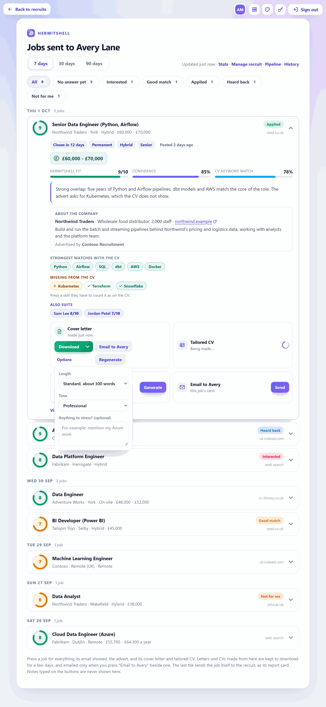

*The cover letter's **Options** open.*

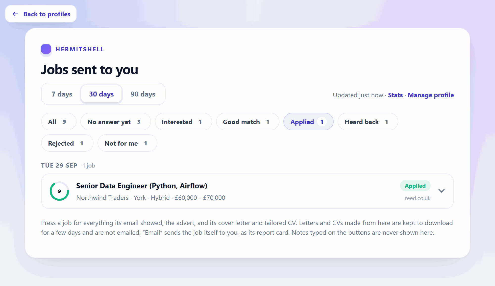

*Filtered to **Applied** over 30 days.*

### Theme and branding

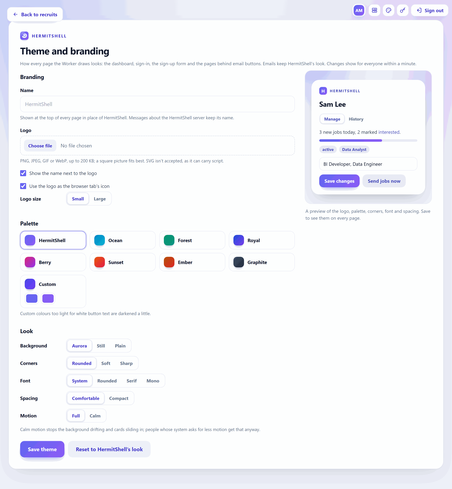

`/admin/theme`, from the palette button beside the server button (admins only). It starts on
HermitShell's own look ([more](feedback-worker.md#theme-and-branding)).

| Part | What it does |
| --- | --- |
| **Name** / **Logo** | Replace HermitShell at the top of every page. PNG, JPEG, GIF or WebP up to 200 KB; SVG is refused |
| **Show the name next to the logo** / **Use the logo as the browser tab's icon** / **Logo size** | How the logo is shown |
| **Palette** | Eight palettes, or **Custom** with two colour pickers |
| **Background** / **Corners** / **Font** / **Spacing** / **Motion** | The look of every page |
| **Preview** | Follows the choices as you make them, and shows a logo as soon as it is picked, before saving; one too big or not a picture is refused at once |
| **Save theme** / **Reset to HermitShell's look** | Apply for everyone, or go back to the default |
| **Back to recruits** | Returns to the dashboard |

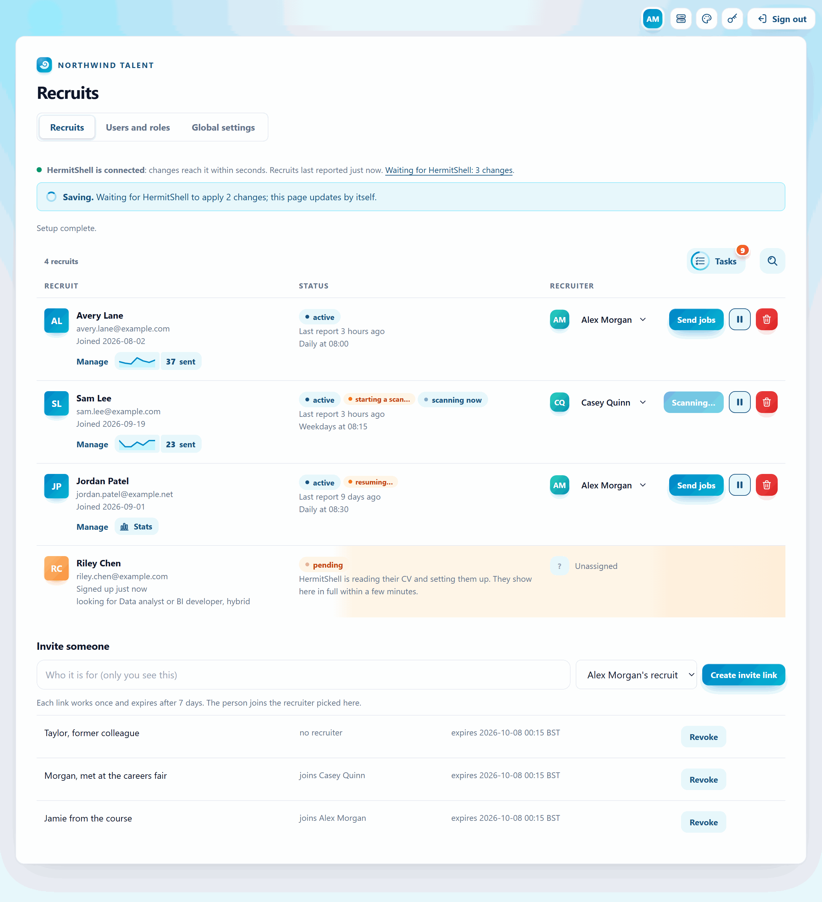

*The Recruits page after saving the name **Northwind Talent**, the **Ocean** palette and soft corners.*

## Regenerating these images

The pictures are made by the real code, so they stay accurate after a change. Run this from the
repository root with Python, Node.js 18+ and Chrome, Chromium or Edge installed:

```sh
pip install requests pillow pymupdf
python3 scripts/screenshots/make.py                 # rewrites docs/images/{emails,worker}/ and the README image
python3 scripts/screenshots/make.py --chrome /usr/bin/chromium --out /tmp/shots
```

`make.py` renders the emails and PDFs with fictional data in a temporary HermitShell home (your own
`.env` and state are never read), `worker_pages.mjs` runs the Worker in memory to produce each
page, and headless Chrome takes 2x screenshots trimmed to the content.
