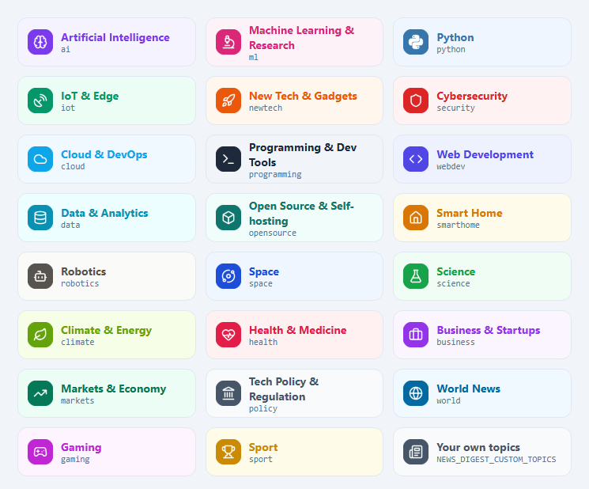

# News Digest

A Hermes cron package that collects the last 24 hours of news on the topics you choose, section by
section. The model Hermes already uses acts as the editor: it picks and summarises the stories that
matter and writes a short briefing, then everything goes out as one HTML email at the time you set.


*Dry run with the default topics. [Full-length email](../../docs/images/news-digest-full.png).*

## What it does

1. **Gather.** For every topic it runs two news searches: one limited to trusted sites for that
   topic, and one broad. If a topic has too few fresh stories, it widens to the past week.
   Stories sent in recent digests are skipped.
2. **Curate.** The editor model reads each topic's candidates. It picks up to
   `NEWS_DIGEST_PER_SECTION` stories, rates their importance, writes headlines and summaries with
   "why it matters", and removes duplicates across topics.
3. **Deepen.** The top story in each topic is fetched in full, so its summary and key points
   come from the article rather than the search snippet.
4. **Brief.** The model writes a 3-4 sentence briefing that leads with the most important news of
   the day.
5. **Email.** Sends a header with stats and section jump links, a top-story card, then each
   topic's picks. Topic icons are PNGs embedded as inline attachments, because Gmail strips SVG.

## Topics

Pick any of these with `NEWS_DIGEST_TOPICS` (comma-separated ids, in the order you want them in the
email), or let the setup wizard ask you. The default is `ai,ml,python,iot,newtech`.



Each catalog topic comes with its own trusted news sites, search queries, colour and icon.

### Your own topics

For anything not in the catalog, list topics as `Title: keyword, keyword`, separated by `||`:

```sh
NEWS_DIGEST_CUSTOM_TOPICS=Formula 1: F1, Grand Prix || Home Brewing: homebrew, craft beer
```

Custom topics are searched across the whole web using their keywords, and appear after the catalog
topics with a generic newspaper icon. The title alone is used as the keyword when you leave the
keywords out.

### Full control: a sections file

For your own trusted sites, queries and colours, set `NEWS_DIGEST_SECTIONS_FILE` to a JSON list of
sections, using [`sections.example.json`](sections.example.json) as a starting point. It replaces
`NEWS_DIGEST_TOPICS` and `NEWS_DIGEST_CUSTOM_TOPICS`. Each section needs these keys:

| Key | Meaning |
| --- | --- |
| `id` | Short unique slug, also used for icon file names |
| `title` | Heading shown in the email |
| `icon` | Name of an SVG in `icons/src` |
| `colour`, `tint` | Accent colour and light background for the section |
| `scope` | Tells the editor what belongs in the section and what does not |
| `sites` | Trusted domains for the site-restricted search (may be empty) |
| `site_query`, `broad_query` | The two search queries |
| `site_tbs` | Optional recency for the site search: `qdr:d` (default) or `qdr:w` |

After adding or recolouring sections, rebuild the icons (needs `pip install pymupdf`):

```sh
python3 icons/build_icons.py my_sections.json
```

A section without its own icon PNGs uses the generic set.

## Files

| File | Purpose |
| --- | --- |
| `news_digest.py` | Entry point run by the cron job; also holds the topic catalog (`TOPICS`) |
| `icons/*.png` | Topic badges, glyphs, stars and the header sun, embedded in the email |
| `icons/src/*.svg` | Icon sources: [Lucide](https://lucide.dev) (ISC) and [Simple Icons](https://simpleicons.org) (CC0) |
| `icons/build_icons.py` | Re-renders the PNGs from the SVGs in each topic's colour |
| `sections.example.json` | Example sections file |
| `.env.example` | Every package setting with its default |

It also needs `hermes_common.py` from [`common/`](../../common) in the same directory, which the
installer handles.

## Install

The quickest way is the setup wizard, run from the repository root:

```sh
python3 scripts/setup.py news-digest
```

It asks for your email and API keys, the digest title and reader description, the topics you want
(from the catalog, plus any of your own) and what time the digest should run, for example `12:00`
or `weekdays 07:30`. It then schedules the cron job and sends a test email. See
[the installation guide](../../docs/installation.md#setup-wizard).

To install by hand instead, on the machine (or inside the container) running Hermes:

```sh
HERMES_HOME=/opt/data ./scripts/install.sh news-digest
```

Add the shared settings from the root [`.env.example`](../../.env.example) (SMTP plus at least
one search provider key) and your topics to `$HERMES_HOME/.env`.

### Try it

```sh
cd /opt/data/scripts
python3 news_digest.py --test-email     # SMTP check only
python3 news_digest.py --dry-run        # full pipeline, no email, no seen-state update
```

A dry run writes the rendered email to `state/news_digest_last.html`. Open that file in a browser
to preview it.

### Schedule it

The wizard does this for you. By hand:

```sh
hermes cron create "0 12 * * *" "News Digest" \
    --name news-digest --script news_digest.py --no-agent --deliver local
```

Cron times use Hermes' timezone (`timezone:` in `config.yaml`); without one that is usually UTC.
Use `0 12 * * 1-5` for weekdays only.

## Command-line options

| Option | Effect |
| --- | --- |
| `--dry-run` | Do everything except send the email and update seen-state |
| `--test-email` | Send a short SMTP test email and exit |
| `--include-seen` | Allow stories that were sent in earlier digests |

## Configuration

See [`.env.example`](.env.example) for every option with its default. The ones you are most
likely to change are:

- **`NEWS_DIGEST_TOPICS`, `NEWS_DIGEST_CUSTOM_TOPICS`.** What the digest covers (see
  [Topics](#topics)).
- **`NEWS_DIGEST_READER`.** Describes who the digest is for, such as "a data engineer working
  with Spark and dbt" or "a keen amateur astronomer". The editor uses it to judge relevance and to
  write the briefing.
- **`NEWS_DIGEST_TITLE`, `NEWS_DIGEST_TAGLINE`.** Email branding and subject line. The tagline is
  built from your topic names when left empty.
- **`NEWS_DIGEST_PER_SECTION`, `NEWS_DIGEST_MIN_IMPORTANCE`.** Control how many stories appear
  and how selective the editor is.
- **`NEWS_DIGEST_COUNTRY`.** Biases searches towards one country's news (`gb`, `us`...).

## Upgrading from Noon Tech Digest

This package used to be called `noon-tech-digest` with `tech_digest.py` and `TECH_DIGEST_*`
settings. Re-run the setup wizard: it copies your `TECH_DIGEST_*` values to `NEWS_DIGEST_*` and
replaces the old cron job with one for `news_digest.py`. You can then delete `tech_digest.py` and
the `TECH_DIGEST_*` lines. The seen-state starts fresh (`state/news_digest_seen.json`).

## Cost and runtime

A run makes 2-3 searches per topic plus one article fetch per topic. With five topics that is
roughly 15-20 Firecrawl credits. Curation takes 2-5 minutes on a 4B model running on a CPU.
