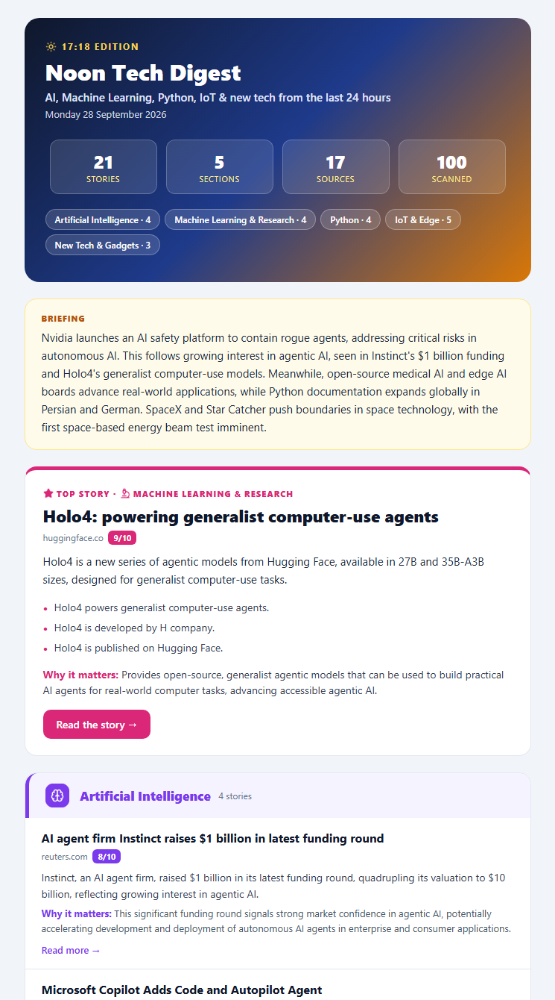

# Noon Tech Digest

A Hermes cron package that collects the last 24 hours of tech news, section by section. The model
Hermes already uses acts as the editor: it picks and summarises the stories that matter and
writes a short briefing, then everything goes out as one HTML email.



*Dry run with the built-in sections. [Full-length email](../../docs/images/noon-tech-digest-full.png).*

## What it does

1. **Gather.** For every section it runs two news searches: one limited to trusted sites for that
   section, and one broad. If a section has too few fresh stories, it widens to the past week.
   Stories sent in recent digests are skipped.
2. **Curate.** The editor model reads each section's candidates. It picks up to
   `TECH_DIGEST_PER_SECTION` stories, rates their importance, writes headlines and summaries with
   "why it matters", and removes duplicates across sections.
3. **Deepen.** The top story in each section is fetched in full, so its summary and key points
   come from the article rather than the search snippet.
4. **Brief.** The model writes a 3-4 sentence briefing that leads with the most important news of
   the day.
5. **Email.** Sends a header with stats and section jump links, a top-story card per section, then
   the remaining picks. Section icons are PNGs embedded as inline attachments, because Gmail
   strips SVG.

Built-in sections cover **Artificial Intelligence**, **Machine Learning & Research**, **Python**,
**IoT & Edge** and **New Tech & Gadgets**. You can replace them entirely with your own JSON file.

## Files

| File | Purpose |
| --- | --- |
| `tech_digest.py` | Entry point run by the cron job |
| `icons/*.png` | Section badges, glyphs, stars and the header sun, embedded in the email |
| `icons/src/*.svg` | Icon sources: [Lucide](https://lucide.dev) (ISC) and [Simple Icons](https://simpleicons.org) (CC0) |
| `icons/build_icons.py` | Re-renders the PNGs from the SVGs in each section's colour |
| `sections.example.json` | Example custom sections file |
| `.env.example` | Every package setting with its default |

It also needs `hermes_common.py` from [`common/`](../../common) in the same directory, which the
installer handles.

## Install

From the repository root, on the machine (or inside the container) running Hermes:

```sh
HERMES_HOME=/opt/data ./scripts/install.sh noon-tech-digest
```

Add the shared settings from the root [`.env.example`](../../.env.example) (SMTP plus at least
one search provider key) to `$HERMES_HOME/.env`.

### Try it

```sh
cd /opt/data/scripts
python3 tech_digest.py --test-email     # SMTP check only
python3 tech_digest.py --dry-run        # full pipeline, no email, no seen-state update
```

A dry run writes the rendered email to `state/tech_digest_last.html`. Open that file in a browser
to preview it.

### Schedule it

```sh
hermes cron create "0 12 * * *" "Noon tech digest" \
    --name noon-tech-digest --script tech_digest.py --no-agent --deliver local
```

Cron times are in the container's timezone, which is usually UTC.

## Command-line options

| Option | Effect |
| --- | --- |
| `--dry-run` | Do everything except send the email and update seen-state |
| `--test-email` | Send a short SMTP test email and exit |
| `--include-seen` | Allow stories that were sent in earlier digests |

## Configuration

See [`.env.example`](.env.example) for every option with its default. The ones you are most
likely to change are:

- **`TECH_DIGEST_READER`.** Describes who the digest is for, such as "a data engineer working
  with Spark and dbt". The editor uses it to judge relevance and to write the briefing.
- **`TECH_DIGEST_TITLE`, `TECH_DIGEST_TAGLINE`.** Email branding and subject line.
- **`TECH_DIGEST_PER_SECTION`, `TECH_DIGEST_MIN_IMPORTANCE`.** Control how many stories appear
  and how selective the editor is.

### Custom sections

Set `TECH_DIGEST_SECTIONS_FILE` to a JSON list of sections, using
[`sections.example.json`](sections.example.json) as a starting point. Each section needs these
keys:

| Key | Meaning |
| --- | --- |
| `id` | Short unique slug, also used for icon file names |
| `title` | Heading shown in the email |
| `icon` | Name of an SVG in `icons/src` |
| `colour`, `tint` | Accent colour and light background for the section |
| `scope` | Tells the editor what belongs in the section and what does not |
| `sites` | Trusted domains for the site-restricted search |
| `site_query`, `broad_query` | The two search queries |
| `site_tbs` | Optional recency for the site search: `qdr:d` (default) or `qdr:w` |

After adding or recolouring sections, rebuild the icons (needs `pip install pymupdf`):

```sh
python3 icons/build_icons.py my_sections.json
```

A section without icon PNGs still renders, just without its badge.

## Cost and runtime

A run makes 2-3 searches per section plus one article fetch per section. With five sections
that is roughly 15-20 Firecrawl credits. Curation takes 2-5 minutes on a 4B model running on a
CPU.
